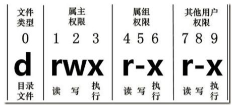
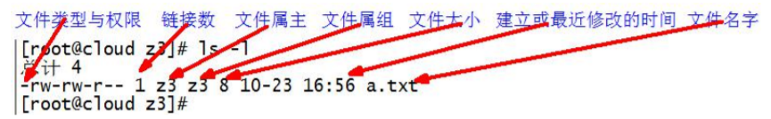
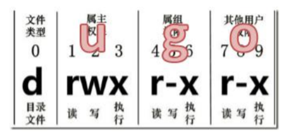

# 7.6 文件权限类

### 7.6.1 文件属性

Linux系统是一种典型的多用户系统，不同的用户处于不同的地位，拥有不同的权限。为了保护系统的安全性，Linux系统对不同的用户访问同一文件（包括目录文件）的权限做了不同的规定。在Linux中我们可以使用ll或者ls -l命令来显示一个文件的属性以及文件所属的用户和组。

1. 从左到右的 10 个字符表示，如图所示



如果没有权限，就会出现减号[ - ]。从左至右用0-9这些数字来表示:

  * 0 首位表示类型  
  在Linux中第一个字符代表这个文件是目录、文件或链接文件等等
    - 代表文件  
    - d 代表目录
    - l 链接文档(link file)；
  * 1-3位确定属主（该文件的所有者）拥有该文件的权限。---User
  * 第4-6位确定属组（所有者的同组用户）拥有该文件的权限，---Group
  * 第7-9位确定其他用户拥有该文件的权限 ---Other

2. rwx 作用文件和目录的不同解释

作用到文件：

[ r ]代表可读(read): 可以读取，查看

[ w ]代表可写(write): 可以修改，但是不代表可以删除该文件，删除一个文件的前提条件是对该文件所在的目录有写权限，才能删除该文件.

[ x ]代表可执行(execute):可以被系统执行

作用到目录：

[ r ]代表可读(read): 可以读取，ls查看目录内容

[ w ]代表可写(write): 可以修改，目录内创建+删除+重命名目录

[ x ]代表可执行(execute):可以进入该目录

3. 案例实操

```shell
ll
#总用量 104
#-rw-------. 1 root root 1248 1 月 8 17:36 anaconda-ks.cfg
#drwxr-xr-x. 2 root root 4096 1 月 12 14:02 dssz
#lrwxrwxrwx. 1 root root 20 1 月 12 14:32 houzi -> xiyou/dssz/houge.tx
```

文件基本属性介绍，如图所示：




如果查看到是文件：链接数指的是硬链接个数。

如果查看的是文件夹：链接数指的是子文件夹个数。

### 7.6.2 chmod 改变权限

1. 基本语法



第一种方式变更权限：

chmod [{u/g/o/a}{+/-/=}{r/w/x}] 文件或目录

第二种方式变更权限：

chmod [mode=421] [文件或目录]

2. 经验技巧

u:所有者 g:所有组 o:其他人 a:所有人(u、g、o 的总和)

r=4 w=2 x=1 rwx=4+2+1=7

3. 案例实操

修改文件使其所属主用户具有执行权限

```shell
chmod u+x houge.txt
```

修改文件使其所属组用户具有执行权限

```shell
chmod g+x houge.txt
```

修改文件所属主用户执行权限,并使其他用户具有执行权限

```shell
chmod u-x,o+x houge.txt
```

采用数字的方式，设置文件所有者、所属组、其他用户都具有可读可写可执行权限。

```shell
chmod 777 houge.txt
```

修改整个文件夹里面的所有文件的所有者、所属组、其他用户都具有可读可写可执行权限。

```shell
chmod -R 777 xiyou/
```

### 7.6.3 chown 改变所有者

1. 基本语法

chown [选项] [最终用户] [文件或目录] （功能描述：改变文件或者目录的所有者）

2. 选项说明

| 选项  |  功能  |
|:---:|:----:|
| -R  | 递归操作 |

3. 案例实操

修改文件所有者

```shell
chown atguigu houge.txt
```

递归改变文件所有者和所有组

```shell
chown -R atguigu:atguigu xiyou/
```

### 7.6.4 chgrp 改变所属组

1. 基本语法

chgrp [最终用户组] [文件或目录] （功能描述：改变文件或者目录的所属组）

2. 案例实操

修改文件的所属组

```shell
chgrp root houge.txt
```