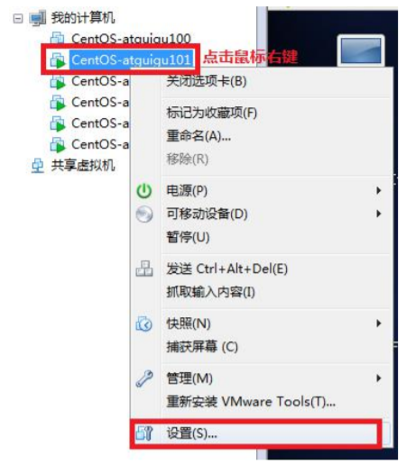
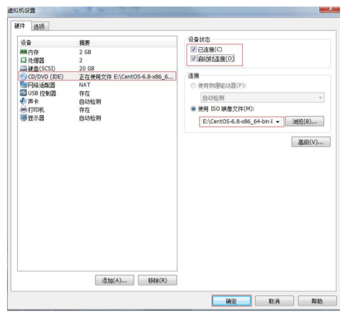
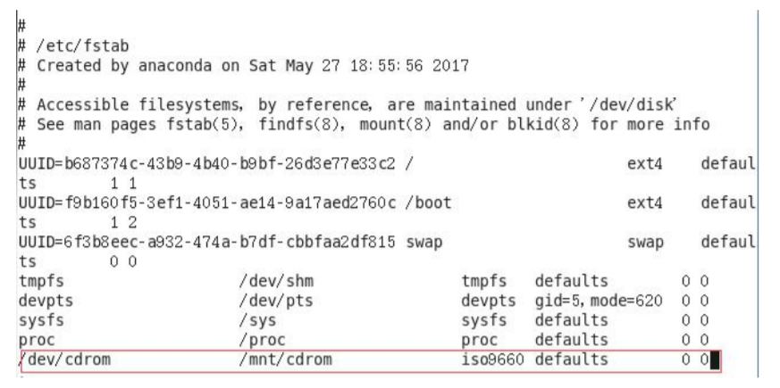

# 7.9 磁盘查看和分区类

du命令来自于英文词组“Disk Usage”的缩写，其功能是用于查看文件或目录的大小。人们经常会把df和du命令混淆，df是用于查看磁盘或分区使用情况的命令，而du命令则是用于按照指定容量单位来查看文件或目录在磁盘中的占用情况。

### 7.9.1 du 查看文件和目录占用的磁盘空间

du: disk usage 磁盘占用情况

1. 基本语法

du [参数] 文件

2. 常用参数

|      参数       |                   功能                    |
|:-------------:|:---------------------------------------:|
|      -k       |              以KB为单位显示文件大小               |
|      -m       |              以MB为单位显示文件大小               |
|      -g       |              以GB为单位显示文件大小               |
|      -s       |                  仅显示总计                  |
|      -h       | 以人们较易阅读的 GBytes, MBytes, KBytes 等格式自行显示 |
|      -a       |            不仅查看子目录大小，还要包括文件             |
|      -c       |           显示所有的文件和子目录大小后，显示总和           |
| --max-depth=n |            指定统计子目录的深度为第 n 层             |

3. 参考实例

查看当前用户主目录占用的磁盘空间大小

```shell
du -sh
```

以易读的容量格式显示指定目录内总文件的大小信息

```shell
du -sh /etc 
```

显示指定文件的大小信息（默认单位为K）

```shell
du anaconda-ks.cfg 
```

### 7.9.2 df 查看磁盘空间使用情况

df命令来自于英文词组”Disk Free“的缩写，其功能是用于显示系统上磁盘空间的使用量情况。df命令显示的磁盘使用量情况含可用、已有及使用率等信息，默认单位为Kb，建议使用-h参数进行单位换算，毕竟135M比138240Kb更利于阅读对吧~

1. 基本语法

df [参数] [对象磁盘/分区]

2. 常用参数

|     参数      |          功能          |
|:-----------:|:--------------------:|
|     -a      |       显示所有系统文件       |
|  -B <块大小>   |      指定显示时的块大小       |
|     -h      |      以容易阅读的方式显示      |
|     -H      |   以1000字节为换算单位来显示    |
|     -i      |       显示索引字节信息       |
|     -k      |      指定块大小为1KB       |
|     -l      |      只显示本地文件系统       |
| -t <文件系统类型> |     只显示指定类型的文件系统     |
|     -T      |     输出时显示文件系统类型      |
|  -- -sync   | 在取得磁盘使用信息前，先执行sync命令 |

3. 参考实例

查看磁盘使用情况

```shell
df -h
```

带有容量单位的显示指定磁盘分区使用量情况

```shell
df -h /boot
```

### 7.9.3 lsblk 查看设备挂载情况

lsblk命令来自于英文词组”list block“的缩写，其功能是用于查看系统的磁盘使用情况。

1. 基本语法

lsblk [参数]

2. 常用参数

| 参数  |          功能          |
|:---:|:--------------------:|
| -a  |        显示所有设备        |
| -b  |     以字节单位显示设备大小      |
| -d  | 不显示 slaves 或 holders |
| -e  |         排除设备         |
| -f  |       显示文件系统信息       |
| -h  |        显示帮助信息        |
| -i  |        仅使用字符         |
| -m  |        显示权限信息        |
| -l  |       使用列表格式显示       |
| -n  |        不显示标题         |
| -o  |         输出列          |
| -P  |  使用key=”value”格式显示   |
| -r  |       使用原始格式显示       |
| -t  |       显示拓扑结构信息       |

3. 参考实例

显示系统中所有磁盘设备的使用情况信息

```shell
lsblk -a
```

显示系统中磁盘设备的归属及权限信息

```shell
lsblk -m
```

### 7.9.4 mount/umount 挂载/卸载

对于Linux用户来讲，不论有几个分区，分别分给哪一个目录使用，它总归就是一个根目录、一个独立且唯一的文件结构。

Linux中每个分区都是用来组成整个文件系统的一部分，它在用一种叫做“挂载”的处理方法，它整个文件系统中包含了一整套的文件和目录，并将一个分区和一个目录联系起来，要载入的那个分区将使它的存储空间在这个目录下获得。

mount命令的功能是用于把文件系统挂载到目录，文件系统指的是被格式化过的硬盘或分区设备，进行挂载操作后，用户便可以在挂载目录中使用硬盘资源了。

默认情况下Linux系统并不会像Windows系统那样自动的挂载光盘和U盘设备，需要自行完成。

umount是“unmount”的缩写，译为“不挂载”。所以它的的作用是卸载已安装的文件系统、目录或文件。

1. 挂载前准备（必须要有光盘或者已经连接镜像文件），如图所示





2. 基本语法

mount [-t vfstype] [-o options] device dir （功能描述：挂载设备）

umount 设备文件名或挂载点 （功能描述：卸载设备）

3. 参数说明

|     参数     |                                                                                                         功能                                                                                                          |
|:----------:|:-------------------------------------------------------------------------------------------------------------------------------------------------------------------------------------------------------------------:|
| -t vfstype | 指定文件系统的类型，通常不必指定。mount 会自动选择正确的类型。常用类型有： <br/> 光盘或光盘镜像：iso9660<br/> DOS fat16 文件系统：msdos <br/>Windows 9x fat32 文件系统：vfat <br/>Windows NT ntfs 文件系统：ntfs <br/>Mount Windows 文件网络共享：smbfs<br/> UNIX(LINUX) 文件网络共享：nfs |
| -o options |                                              主要用来描述设备或档案的挂接方式。常用的参数有：<br/> loop：用来把一个文件当成硬盘分区挂接上系统<br/> ro：采用只读方式挂接设备<br/> rw：采用读写方式挂接设备<br/> iocharset：指定访问文件系统所用字符集                                               |
|   device   |                                                                                                    要挂接(mount)的设备                                                                                                    |
|    dir     |                                                                                               设备在系统上的挂接点(mount point)                                                                                               |

4. 参考实例

挂载光盘镜像文件

```shell
mkdir /mnt/cdrom/ # 建立挂载点

mount -t iso9660 /dev/cdrom /mnt/cdrom/ 
#设备/dev/cdrom 挂载到 挂载点 ： /mnt/cdrom 中
```

卸载光盘镜像文件

```shell
umount /mnt/cdrom
```

5. 设置开机自动挂载

```shell
vi /etc/fstab
```

添加红框中内容，保存退出。



### 7.9.5 fdisk 分区

fdisk命令来自于英文词组“Partition table manipulator for Linux”的缩写，其功能是用于管理磁盘的分区信息。如果一套几百平米的房子内部没有墙壁，虽然看起来会很敞亮，但是各种声音、气味、物品会随意充斥在整个房子内，让人极不舒适，因此需要用墙壁按照功能进行划分，例如卧室、厕所、厨房、阳台等等。

fdisk命令可以用于对磁盘进行分区操作，用户可以根据实际情况进行合理划分，这样后期挂载和使用时会方便很多。

1. 基本语法

fdisk [参数] [设备]

fdisk 硬盘设备名 （功能描述：对新增硬盘进行分区操作）

2. 常用参数

| 参数  |                  功能                  |
|:---:|:------------------------------------:|
| -b  |              指定每个分区的大小               |
| -l  |           列出指定的外围设备的分区表状况            |
| -s  |        将指定的分区大小输出到标准输出上，单位为区块        |
| -u  | 搭配”-l”参数列表，会用分区数目取代柱面数目，来表示每个分区的起始地址 |
| -v  |                显示版本信息                |

3. 经验技巧

该命令必须在 root 用户下才能使用

4. 功能说明

* Linux 分区
  - Device：分区序列
  - Boot：引导
  - Start：从X磁柱开始
  - End：到Y磁柱结束
  - Blocks：容量
  - Id：分区类型ID
  - System：分区类型
* 分区操作按键说明
  - m：显示命令列表
  - p：显示当前磁盘分区
  - n：新增分区
  - w：写入分区信息并退出
  - q：不保存分区信息直接退出

5. 参考实例

查看系统分区情况

```shell
fdisk -l
```