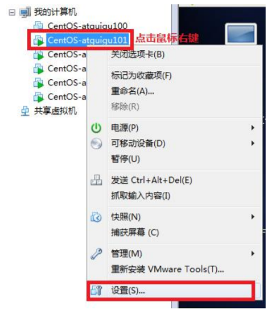
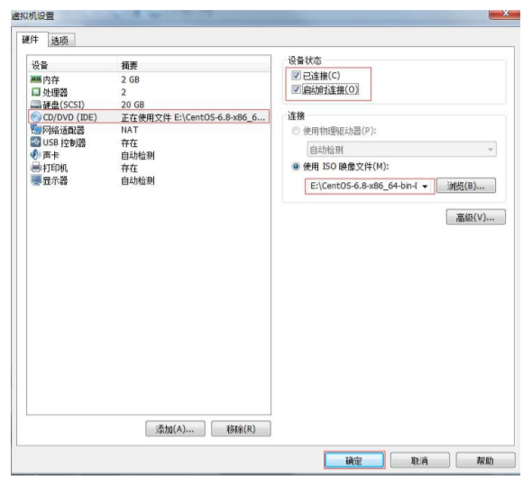
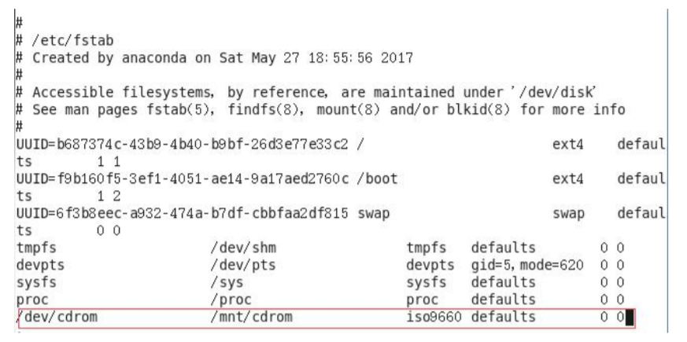

# 7.9 磁盘查看和分区类

### 7.9.1 du 查看文件和目录占用的磁盘空间

du: disk usage 磁盘占用情况

1. 基本语法

du 目录/文件 （功能描述：显示目录下每个子目录的磁盘使用情况）

2. 选项说明

|      选项       |                   功能                    |
|:-------------:|:---------------------------------------:|
|      -h       | 以人们较易阅读的 GBytes, MBytes, KBytes 等格式自行显示 |
|      -a       |            不仅查看子目录大小，还要包括文件             |
|      -c       |           显示所有的文件和子目录大小后，显示总和           |
|      -s       |                  只显示总和                  |
| --max-depth=n |            指定统计子目录的深度为第 n 层             |

3. 案例实操

查看当前用户主目录占用的磁盘空间大小

```shell
du -sh
```

### 7.9.2 df 查看磁盘空间使用情况

df: disk free 空余磁盘

1. 基本语法

df 选项 （功能描述：列出文件系统的整体磁盘使用量，检查文件系统的磁盘空间占用情况）

2. 选项说明

| 选项  |                   功能                    |
|:---:|:---------------------------------------:|
| -h  | 以人们较易阅读的 GBytes, MBytes, KBytes 等格式自行显示 |

3. 案例实操

查看磁盘使用情况

```shell
df -h
```

### 7.9.3 lsblk 查看设备挂载情况

1. 基本语法

lsblk （功能描述：查看设备挂载情况）

2. 选项说明

| 选项  |          功能          |
|:---:|:--------------------:|
| -f  | 查看详细的设备挂载情况，显示文件系统信息 |

### 7.9.4 mount/umount 挂载/卸载

对于Linux用户来讲，不论有几个分区，分别分给哪一个目录使用，它总归就是一个根目录、一个独立且唯一的文件结构。

Linux中每个分区都是用来组成整个文件系统的一部分，它在用一种叫做“挂载”的处理方法，它整个文件系统中包含了一整套的文件和目录，并将一个分区和一个目录联系起来，要载入的那个分区将使它的存储空间在这个目录下获得。

1. 挂载前准备（必须要有光盘或者已经连接镜像文件），如图所示





2. 基本语法

mount [-t vfstype] [-o options] device dir （功能描述：挂载设备）

umount 设备文件名或挂载点 （功能描述：卸载设备）

3. 参数说明

|     参数     |                                                                                                         功能                                                                                                          |
|:----------:|:-------------------------------------------------------------------------------------------------------------------------------------------------------------------------------------------------------------------:|
| -t vfstype | 指定文件系统的类型，通常不必指定。mount 会自动选择正确的类型。常用类型有： <br/> 光盘或光盘镜像：iso9660<br/> DOS fat16 文件系统：msdos <br/>Windows 9x fat32 文件系统：vfat <br/>Windows NT ntfs 文件系统：ntfs <br/>Mount Windows 文件网络共享：smbfs<br/> UNIX(LINUX) 文件网络共享：nfs |
| -o options |                                              主要用来描述设备或档案的挂接方式。常用的参数有：<br/> loop：用来把一个文件当成硬盘分区挂接上系统<br/> ro：采用只读方式挂接设备<br/> rw：采用读写方式挂接设备<br/> iocharset：指定访问文件系统所用字符集                                               |
|   device   |                                                                                                    要挂接(mount)的设备                                                                                                    |
|    dir     |                                                                                               设备在系统上的挂接点(mount point)                                                                                               |

4. 案例实操

挂载光盘镜像文件

```shell
mkdir /mnt/cdrom/ # 建立挂载点

mount -t iso9660 /dev/cdrom /mnt/cdrom/ 
#设备/dev/cdrom 挂载到 挂载点 ： /mnt/cdrom 中
```

卸载光盘镜像文件

```shell
umount /mnt/cdrom
```

5. 设置开机自动挂载

```shell
vi /etc/fstab
```

添加红框中内容，保存退出。



### 7.9.5 fdisk 分区

1. 基本语法

fdisk -l （功能描述：查看磁盘分区详情）

fdisk 硬盘设备名 （功能描述：对新增硬盘进行分区操作）

2. 选项说明

| 选项  |  功能     |
|:---:|:-----:|
| -l  |  显示所有硬盘的分区列表     |

3. 经验技巧

该命令必须在 root 用户下才能使用

4. 功能说明

* Linux 分区
  - Device：分区序列
  - Boot：引导
  - Start：从X磁柱开始
  - End：到Y磁柱结束
  - Blocks：容量
  - Id：分区类型ID
  - System：分区类型
* 分区操作按键说明
  - m：显示命令列表
  - p：显示当前磁盘分区
  - n：新增分区
  - w：写入分区信息并退出
  - q：不保存分区信息直接退出

5. 案例实操

查看系统分区情况

```shell
fdisk -l
```