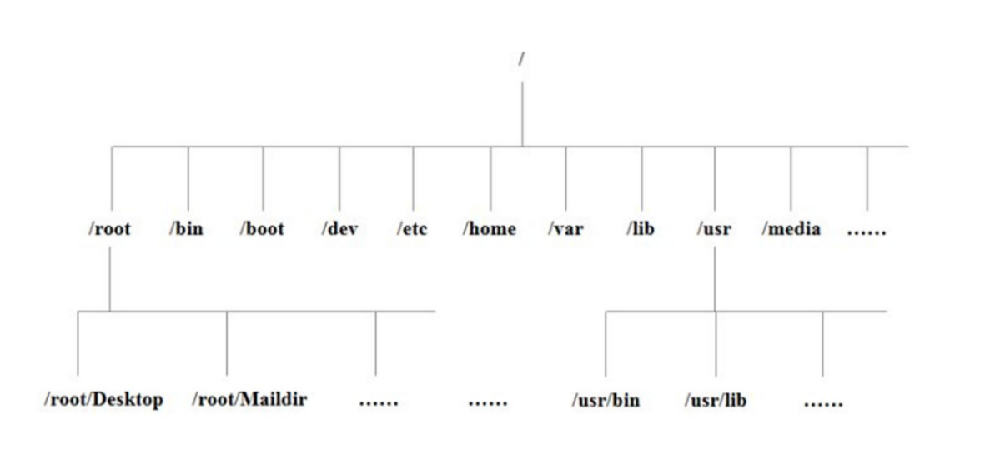

# 第三章Linux文件与目录结构

## 3.1 Linux 文件

Linux 系统中一切皆文件。

## 3.2 Linux 目录结构

Linux 目录结构简介：

* /bin

  是Binary的缩写，这个目录存放着最经常使用的命令

* /sbin

  s就是Super User的意思，这里存放的是系统管理员使用的系统管理程序

* /home

  该目录为系统管理员，也称超级权限者的用户主目录

* /lib

  系统开机所需要最基本的动态链接共享库，其作用类似与Windows里的DLL文件。几乎所有的应用程序都需要用到这些共享库

* /lost+found

  这个目录一般情况下是空的，当系统非法关机后，这里就存放了一些文件

* /etc

  所有的系统管理所需要的配置文件和子目录

* /usr

  这是一个非常重要的目录

