# 第九章 克隆与备份虚拟机

## 9.1 克隆

1. 从现有虚拟机(关机状态)克隆出新虚拟机，右键选择管理=>克隆

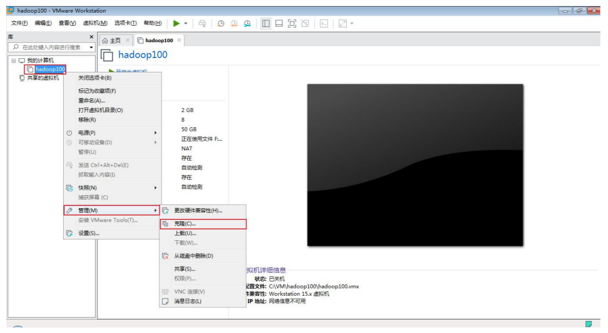

2. 点击下一步

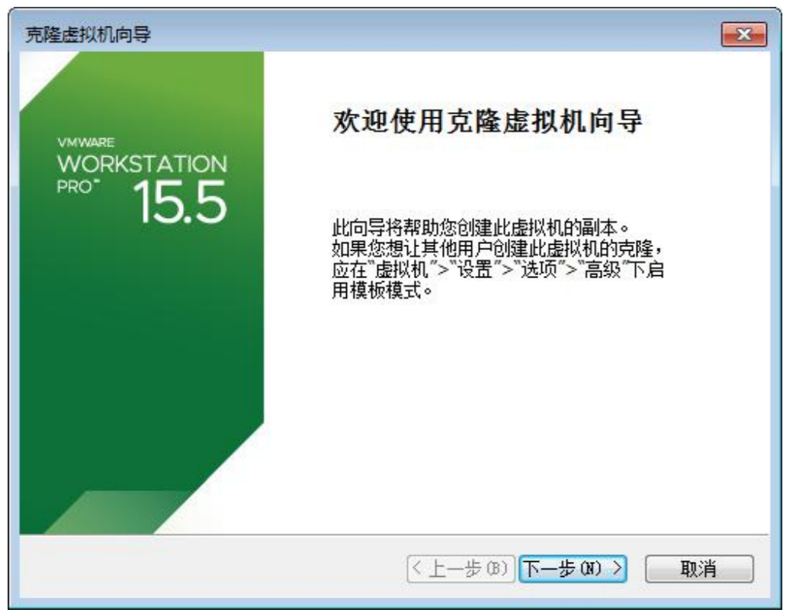

3. 选择虚拟机中的当前状态

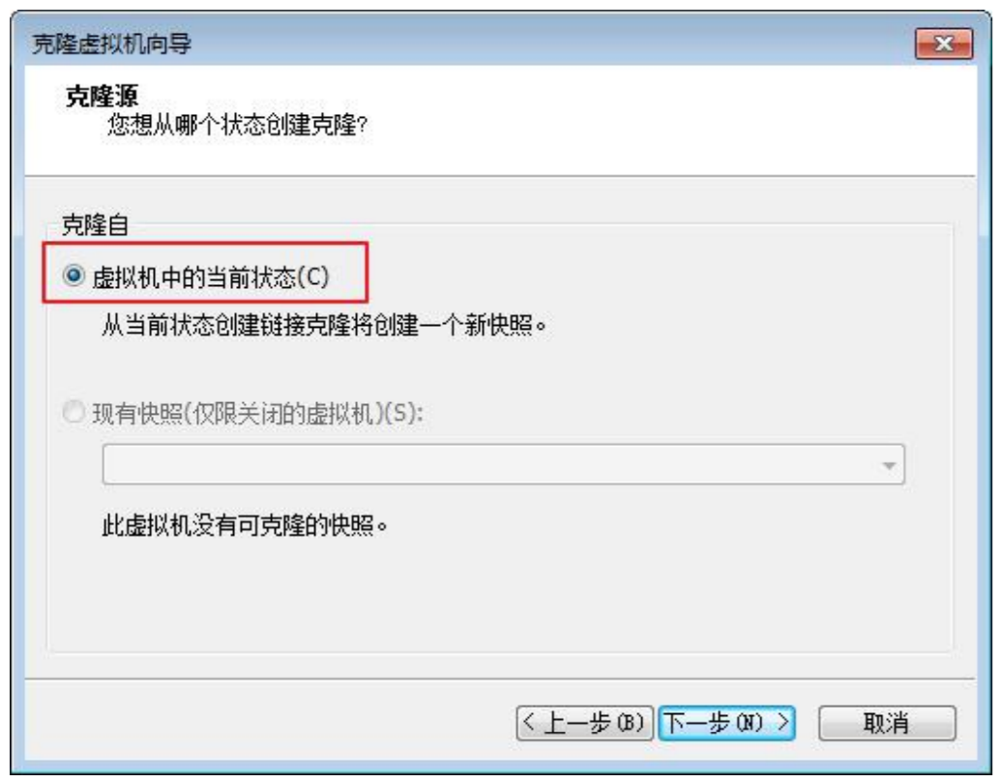

4. 选择创建完整克隆

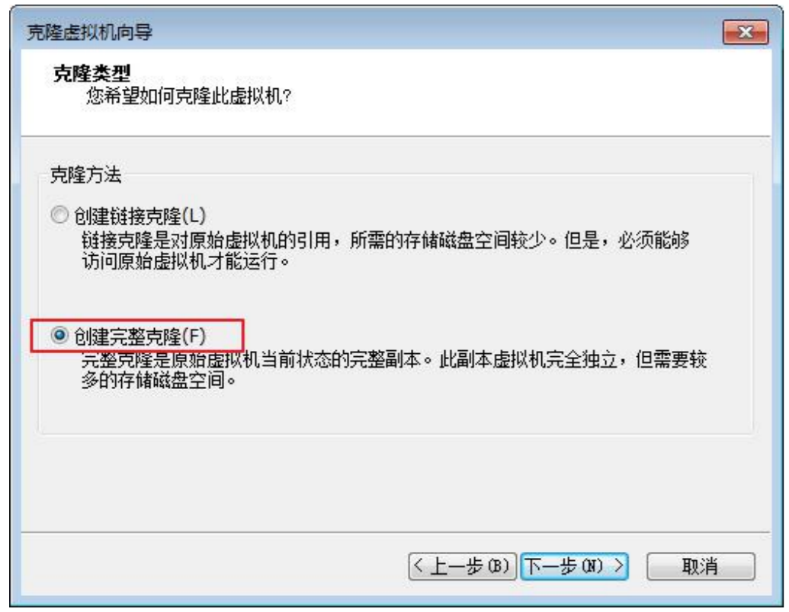

5. 设置虚拟机名称及存储位置

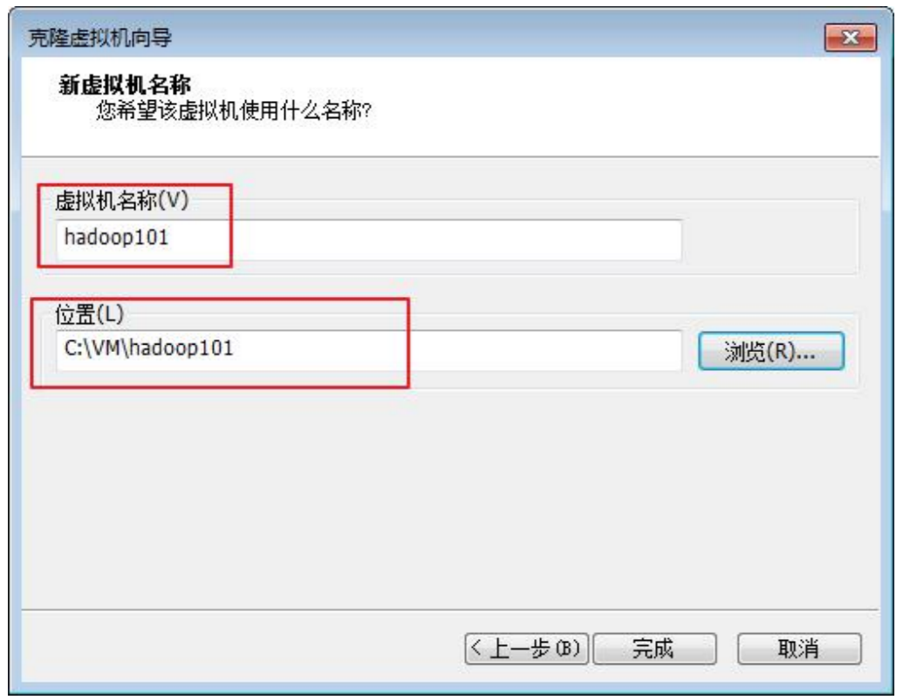

6. 等待克隆完成，

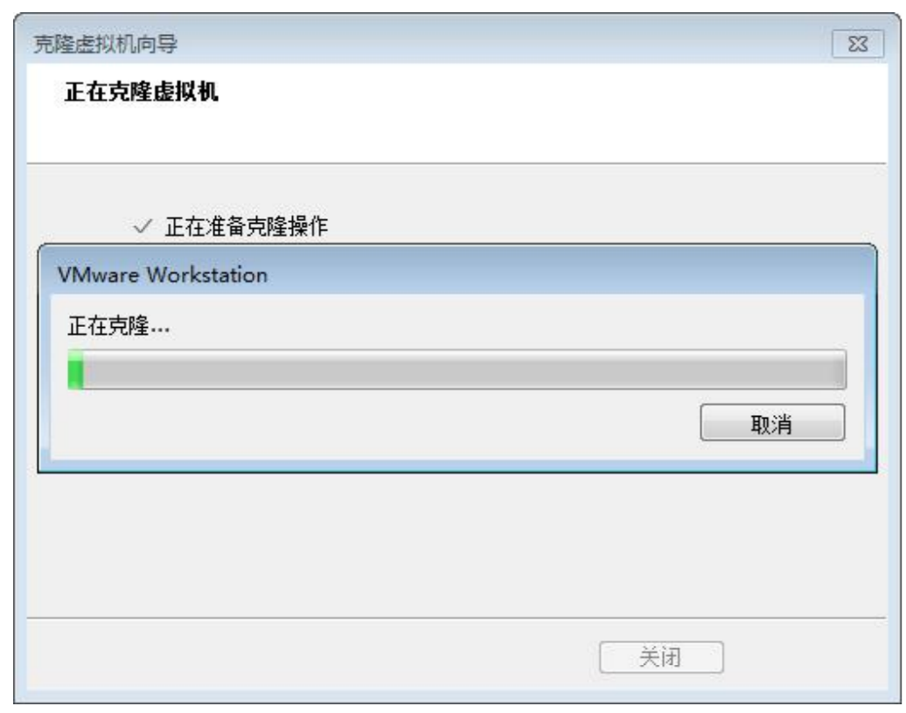

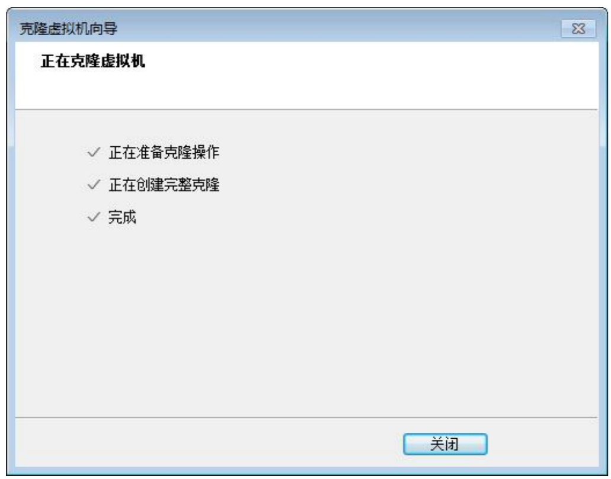

7. 开机修改系统相关配置

注意: 使用 root 用户。

修改 vim /etc/sysconfig/network-scripts/ifcfg-ens33 ，修改 IP 地址，

```shell
vim /etc/sysconfig/network-scripts/ifcfg-eth0
```

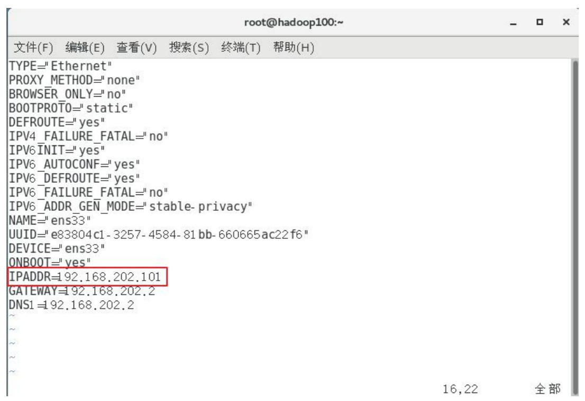

修改 /etc/hostname ,修改主机名

```shell
vim /etc/hostname
```

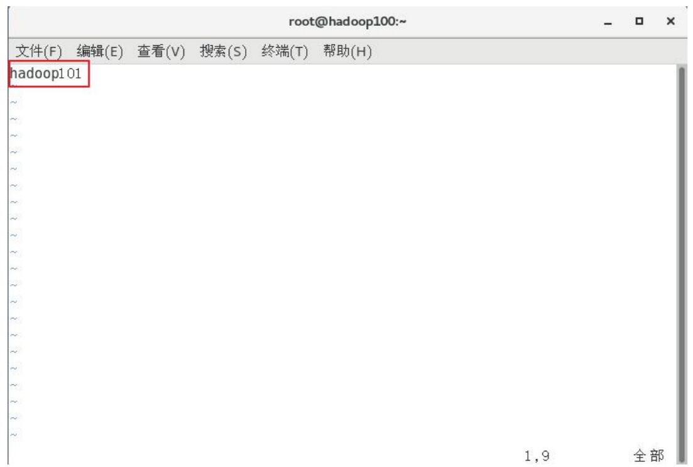

### 9.2 快照

如果在使用虚拟机系统的时候(比如 linux)，想回到原先的某一个状态，可能有些误操作造成系统异常，需要回到原先某个正常运行的状态，vmware 也提供了这样的功能，就叫快照管理

1. 给虚拟机拍摄快照

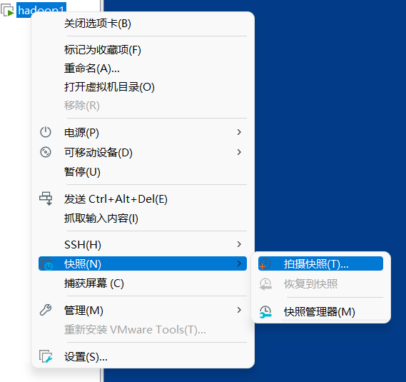

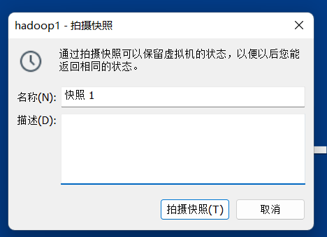

2. 拍照完成后可以恢复到之前的状态

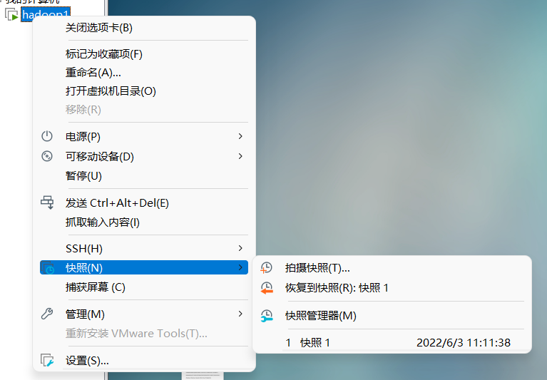