# 第 1 章 VMware

## 1 VMware 安装

一台电脑本身是可以装多个操作系统的，但是做不到多个操作系统切换自如，所以我们需要一款软件帮助我们达到这个目的。

推荐的软件为 VMware，VMware 可以使用户在一台计算机上同时运行多个操作系统，还可以像 Windows 应用程序一样来回切换。用户可以如同操作真实安装的系统一样操作虚拟机系统，甚至可以在一台计算机上将几个虚拟机系统连接为一个局域网或者连接到互联网。

以下是 VMware Workstation Pro 15.5 的安装步骤。

### 1.1 VMware Workstation Pro 15.5 安装包

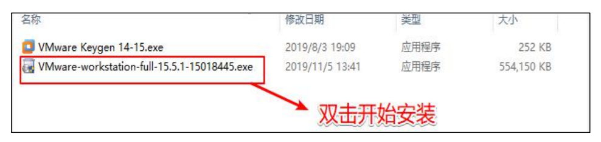

### 1.2 欢迎界面

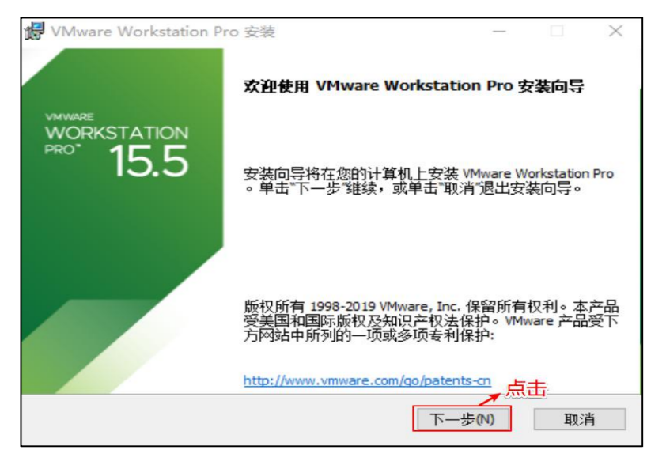

### 1.3 同意许可证

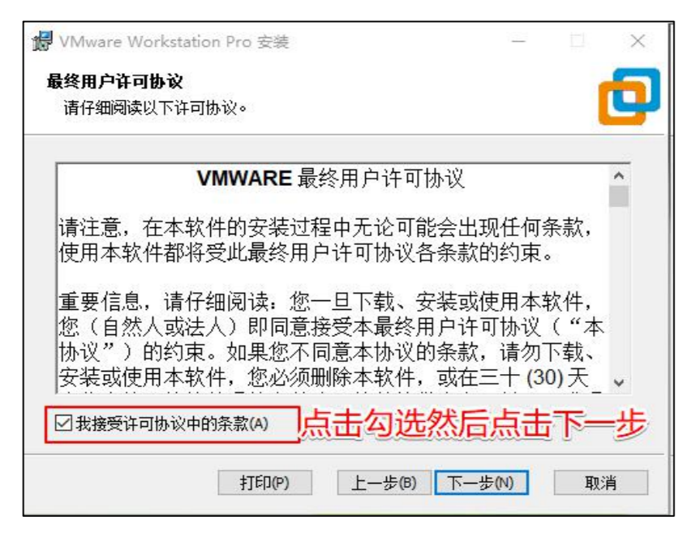

### 1.4 选择安装路径

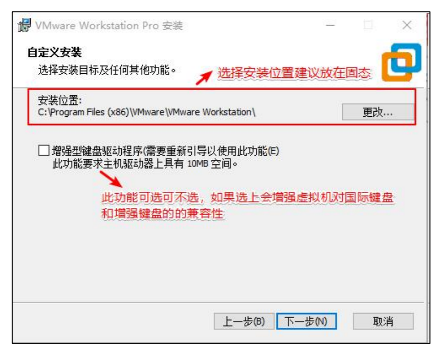

### 1.5 用户体检计划

每次开启虚拟机时，会提醒让你更新版本，建议两个都不勾。

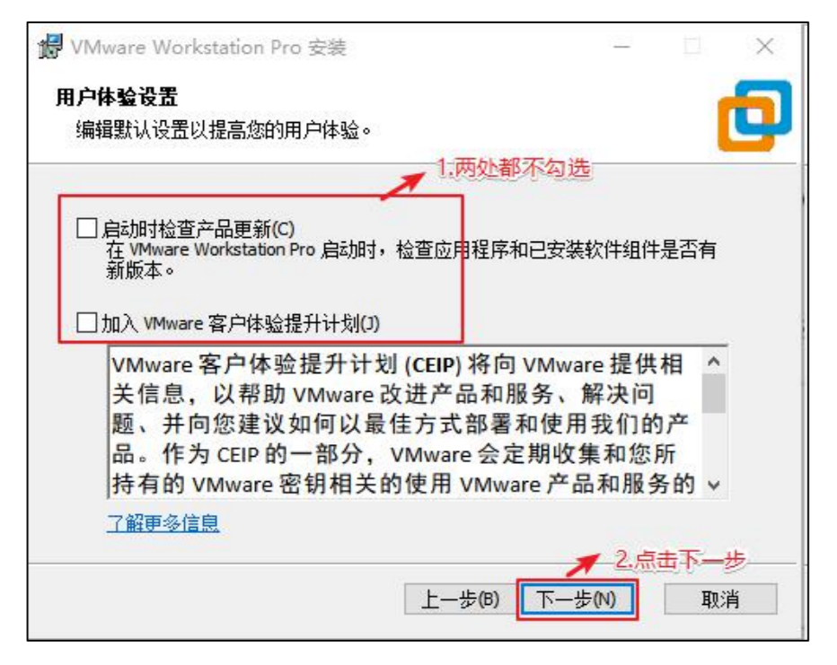

### 1.6 快捷方式

建议勾选，安装后使用起来会比较方便。

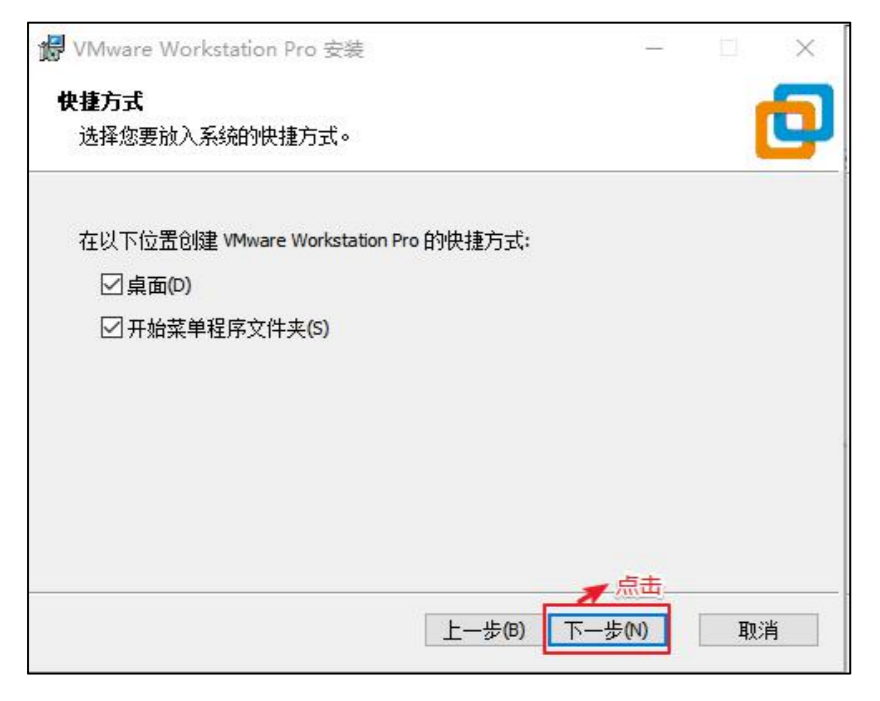

### 1.7 开始安装

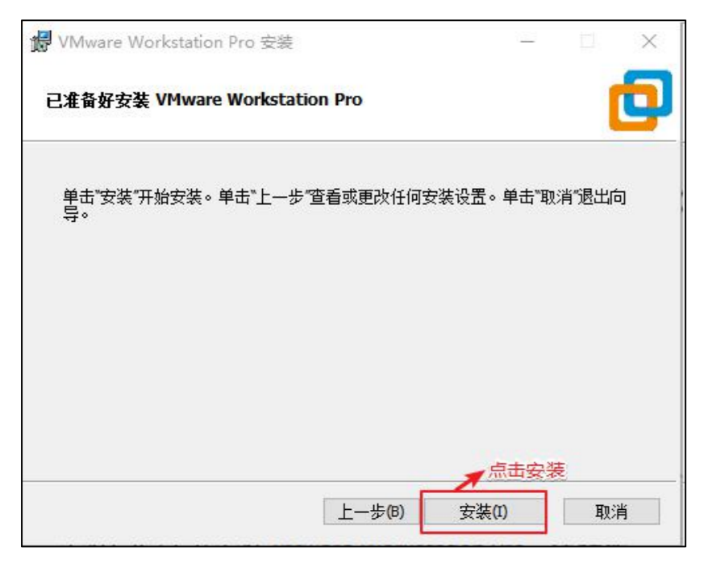

### 1.8 等待安装完成

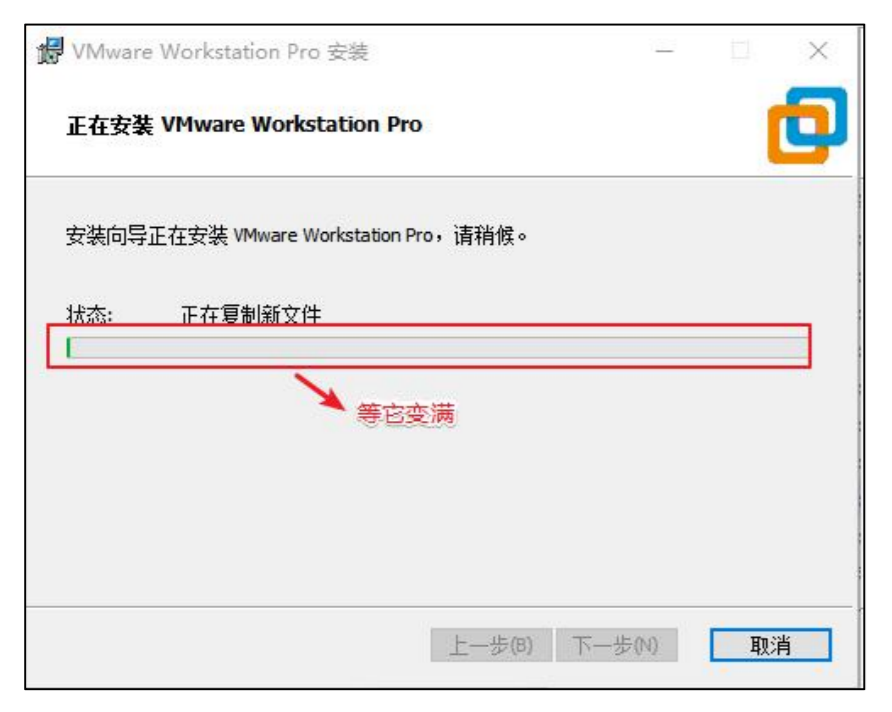

### 1.9 安装完成

输入许可证，激活 VMware。

注：如果点击的是完成也没关系，后面还是输入许可证的。

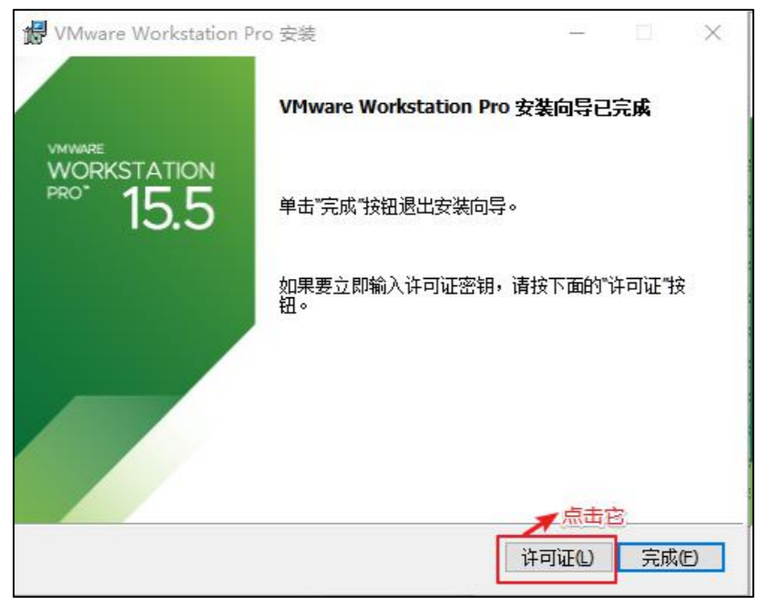

### 1.10 输入许可证

1. 生成许可证(在当时安装包的同名的目录下)

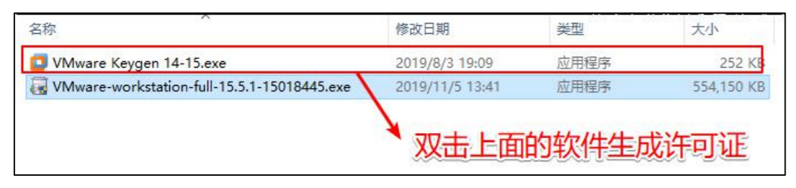

2. 选择版本并生成许可证

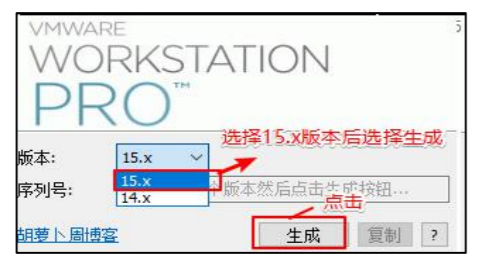

3. 复制生成好的序列号

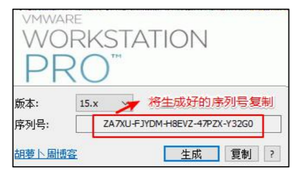

4. 将生成好的序列号粘贴到 vmware 里

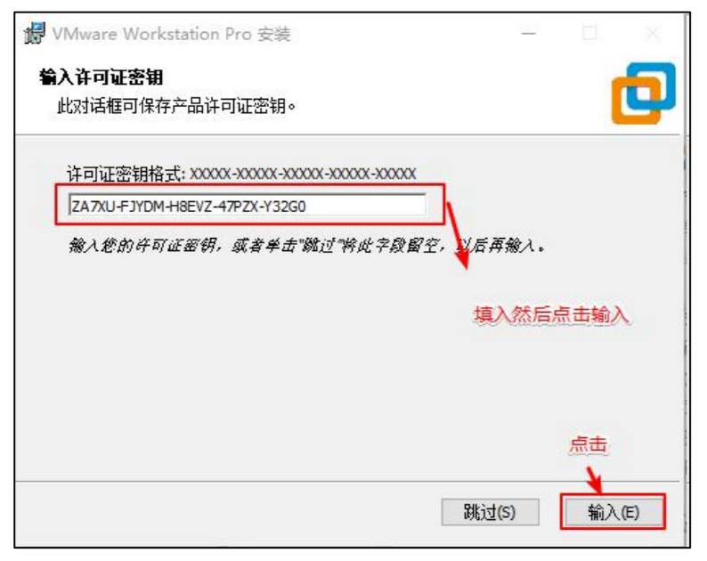

### 1.11 VMware 安装完毕

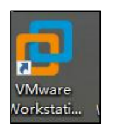

桌面上的快捷方式，双击它就可以使用了。