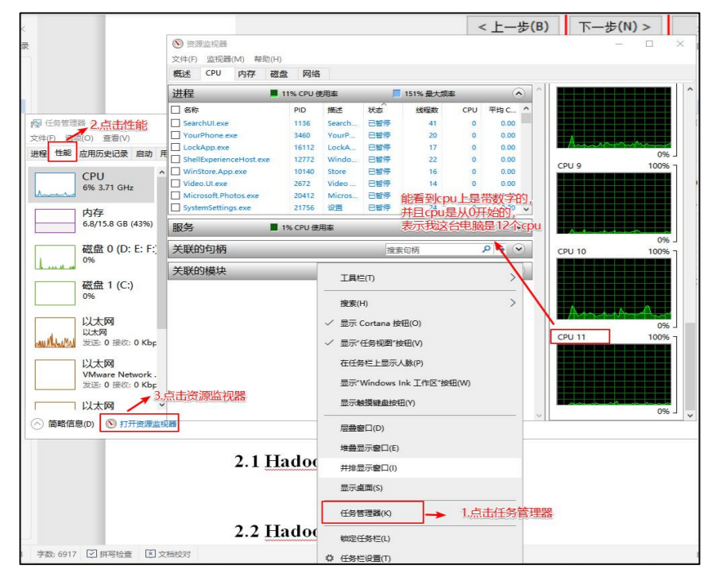
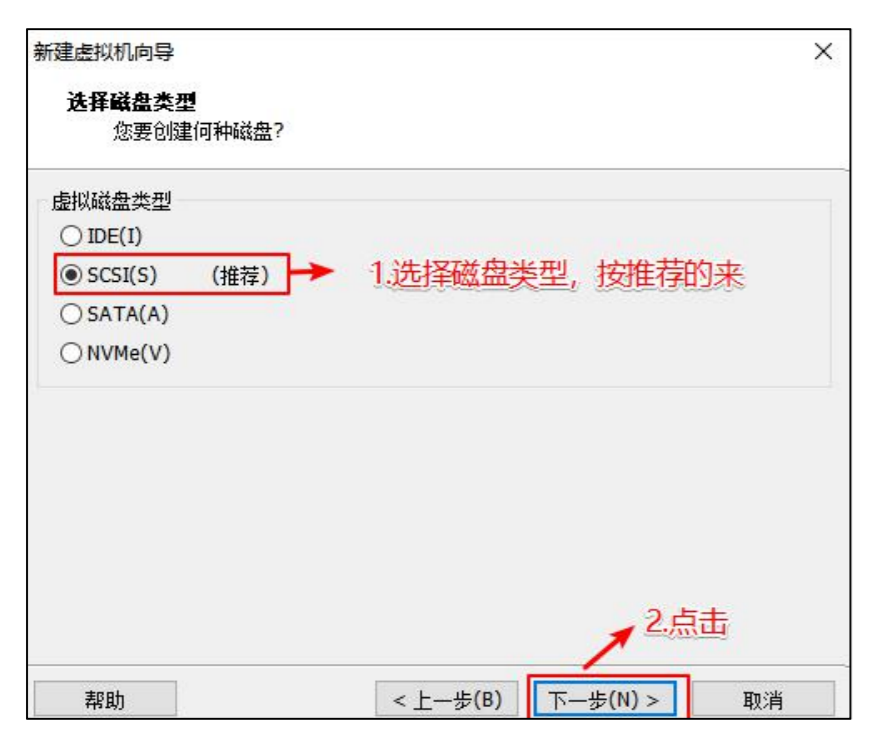
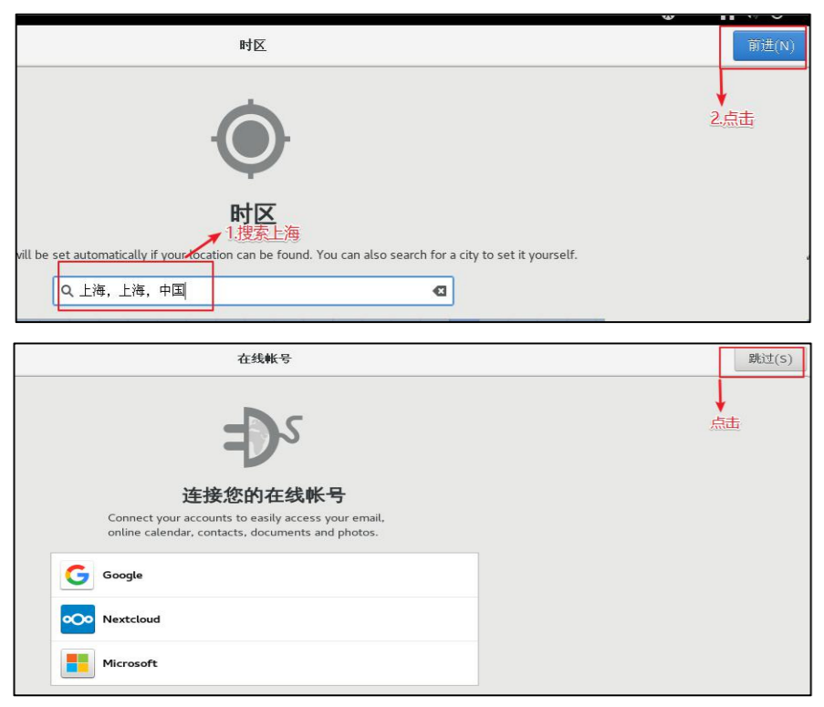
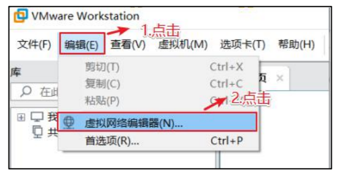
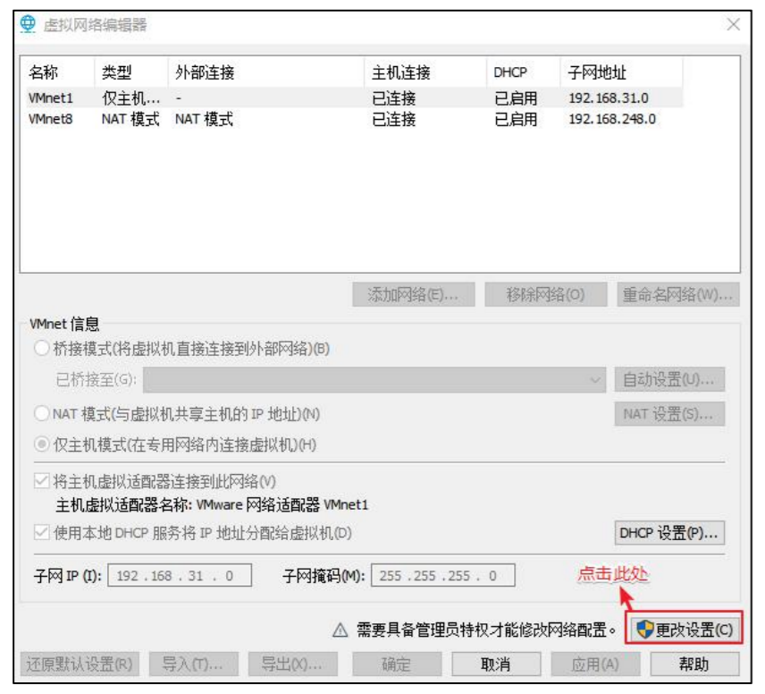
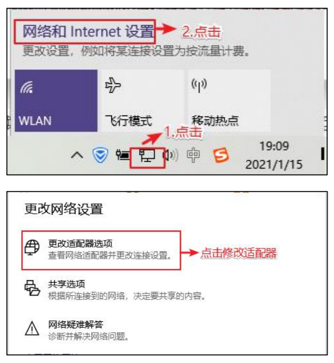

# 第 2 章 CentOS

系统的安装得分两个步骤，第一步得配置一台电脑，选配 cpu，内存，磁盘，网卡等硬件。第二步才是安装系统。

## 2.1 配置电脑

### 2.1.1 进入 VMware

双击 VMware 图标，看到如下界面。


### 2.1.2 自定义新的虚拟机


### 2.1.3 解决虚拟机的兼容性


### 2.1.4 选择当前虚拟机的操作系统

我们先配置电脑，再安装系统。  


### 2.1.5 选择虚拟机将来需要安装的系统

因为不同的操作系统需要解决不同的兼容性问题，所以需要选择将来用什么系统，提前做适配。


### 2.1.6 配置电脑

给自己配置电脑取个名字，并存放在物理机的位置在哪。


### 2.1.7 选择 CPU 的个数

有个原则就是选满（跟物理机的 CPU 个数相同，但是不能超过）。

1) 查看物理机 CPU 个数（windows10 为例）



2) 设置虚拟机处理器的数量


### 2.1.8 设置虚拟机的内存

内存大小有一定要求，建议 4g，不能给太多，后期会有多台虚拟机同时启动。


### 2.1.9 选择虚拟机上网方式

1) 选择 NAT 的方式


2) 没有 VMware 之前物理机的网络适配器信息（每个人不同，我只有 3 个）


3) 安装 VMware 之后物理机的网络适配器信息（会多两个 vmnet1 和 vmnet8）


注：vmnet8 是虚拟机使用 NAT 模式上网的网卡

### 2.1.10 选择对应的文件系统的 IO 方式


### 2.1.11 选择磁盘的类型



### 2.1.12 选择磁盘的种类


### 2.1.13 选择虚拟机的磁盘大小


### 2.1.14 虚拟机文件的存放位置


### 2.1.15 电脑配置完毕


## 2.2 安装系统（CentOS7）


注：在安装系统之前需要检查自己 bios 的虚拟化设置是否打开（大部分的电脑都是打开的，大家可以先尝试直接安装，如果出现错误再去调试，没有出错就不用管了）以下是查看虚拟机 bios 是否开启的方式。

1. window10


2. window7 里面看不到（得去 bios 里面看）

3. 如果发现 bios 虚拟化没有开启怎么办，重启电脑，在加载界面时按 f1-f10,或者电脑旁边一个小洞，具体怎么进入得去查一下（按照自己电脑的型号去查）

4. 修改虚拟化为开启（thinkpad 为例）找到 security 里面的 VT 并改成 enabled


注：如果虚拟化没有开启报的是以下错误。


### 2.2.1 选择 cd/dvd 的方式安装系统


### 2.2.2 系统安装引导界面

你得需要将鼠标点击进入界面中，但是鼠标会消失，你此刻得用键盘的上下键来控制选项，图标变白了表示当前选中的是哪个选项，然后敲回车，表示执行所选选项。

注：如果这个时候你需要鼠标可以使用 ctrl+alt 一起按呼出鼠标。


耐心等待它的安装。


会自动跳转下面的界面。


### 2.2.3 需要定制化的内容

按照编号依次点击。


1. 调整时间差


2. 安装 GHOME（图形化界面的方式）注意图上标注的点击顺序


3. 配置磁盘分区


4. 手动添加分区


5. 添加 boot 区 给上 1G 容量后点击添加挂载点


6. 添加 swap 交换分区


7. 配置根(/)目录


根目录作为存储使用，将剩下的空间都给他（50 - 4 - 1）= 45


3 个分区都配置完毕过后可以点击完成。


8. 分区配置完毕，点击接受更改


9. 关闭 kdump 本身虚拟机内存就不够，他会吃掉一部分内存，我们尽量省一点


10. 修改主机名


11. 是否打开安全协议（开启与否都可以）


12. 开始安装


13. 安装时间比较长 大概需要 10 几分钟（设置 root 用户密码，一定要设置）


密码设置成什么自己决定，但是不要忘，建议使用（123456）


### 2.2.4 虚拟机的使用引导界面

1. 安装完成 重启虚拟机


2. 进入引导界面(以下内容就按照图片走，就不做过多解释)





安装完成。

### 2.2.5 切换 root 用户

当前登录的用户是刚刚创建的用户，权限会缺少，所以使用 root，修改一些内容更加方便。


1. 切换 root 用户


刚才的引导再来一遍（就不再放图片了）。


最后的用户变成 root 表示切换成功。

## 2.3 网络配置

对安装好的 VMware 进行网络配置，方便虚拟机连接网络，本次设置建议选择 NAT 模式，需要宿主机的 Windows 和虚拟机的 Linux 能够进行网络连接，同时虚拟机的 Linux 可以通过宿主机的 Windows 进入互联网。

### 2.3.1 编辑 VMware 的网络配置






然后全部点击确定，VMware 的网络配置就好了。

### 2.3.2 windows 的网络配置

以下以 window10 为例。

1. 找到




按如上格式修改 IP 信息（地址，网关，DNS 服务器），修改完毕后全部点击确定退出。

## 2.4 虚拟机网络 IP 修改地址配置

1. 修改网络 IP 地址为静态 IP 地址，避免 IP 地址经常变化，从而方便节点服务器间的互相通信。

```shell
vim /etc/sysconfig/network-scripts/ifcfg-ens33
```

2. 以下加粗的项必须修改，有值的按照下面的值修改，没有该项的则需要增加。

```text
TYPE="Ethernet" #网络类型（通常是 Ethemet）
PROXY_METHOD="none"
BROWSER_ONLY="no"
BOOTPROTO="static" #IP 的配置方法[none|static|bootp|dhcp]（引导时不使用协议|静态分配 IP|BOOTP 协议|DHCP 协议）
DEFROUTE="yes"
IPV4_FAILURE_FATAL="no"
IPV6INIT="yes"
IPV6_AUTOCONF="yes"
IPV6_DEFROUTE="yes"
IPV6_FAILURE_FATAL="no"
IPV6_ADDR_GEN_MODE="stable-privacy"
NAME="ens33"
UUID="e83804c1-3257-4584-81bb-660665ac22f6" #随机 id
DEVICE="ens33" #接口名（设备,网卡）
ONBOOT="yes" #系统启动的时候网络接口是否有效（yes/no）
#IP 地址
IPADDR=192.168.10.100
#网关
GATEWAY=192.168.10.2
#域名解析器
DNS1=192.168.10.2
```

3. 修改 IP 地址后的结果如图所示，执行“:wq”命令，保存退出


4. 执行 systemctl restart network 命令，重启网络服务。如果报错，则执行“reboot”命令，重启虚拟机。

```shell
systemctl restart network
```

5. 使用 ifconfig 命令查看当前 IP

```shell
ifconfig
```


6. 保证 Linux 系统 ifcfg-ens33 文件中 IP 地址、虚拟网络编辑器地址和 Windows 系统 VM8 网络 IP 地址相同

## 2.5 修改主机名和 hosts 文件

1. 修改主机名称

```shell
vim /etc/hostname
hadoop100
```

2. 配置 Linux 克隆机主机名称映射 hosts 文件，打开/etc/hosts

```shell
vim /etc/hosts
```

添加如下内容

```text
192.168.10.100 hadoop100
192.168.10.101 hadoop101
192.168.10.102 hadoop102
192.168.10.103 hadoop103
192.168.10.104 hadoop104
192.168.10.105 hadoop105
192.168.10.106 hadoop106
192.168.10.107 hadoop107
192.168.10.108 hadoop108
```

3. 重启克隆机 hadoop102

```shell
reboot
```

4. 修改 windows 的主机映射文件（hosts 文件）
  * 如果操作系统是 window7，可以直接修改
    - 进入 C:\Windows\System32\drivers\etc 路径
    - 打开 hosts 文件并添加如下内容，然后保存

```text
192.168.10.100 hadoop100
192.168.10.101 hadoop101
192.168.10.102 hadoop102
192.168.10.103 hadoop103
192.168.10.104 hadoop104
192.168.10.105 hadoop105
192.168.10.106 hadoop106
192.168.10.107 hadoop107
192.168.10.108 hadoop108
```

  * 如果操作系统是 window10，先拷贝出来，修改保存以后，再覆盖即可
    - 进入 C:\Windows\System32\drivers\etc 路径
    - 拷贝 hosts 文件到桌面
    - 打开桌面 hosts 文件并添加如下内容
    - 将桌面 hosts 文件覆盖 C:\Windows\System32\drivers\etc 路径 hosts 文件

```text
192.168.10.100 hadoop100
192.168.10.101 hadoop101
192.168.10.102 hadoop102
192.168.10.103 hadoop103
192.168.10.104 hadoop104
192.168.10.105 hadoop105
192.168.10.106 hadoop106
192.168.10.107 hadoop107
192.168.10.108 hadoop108
```