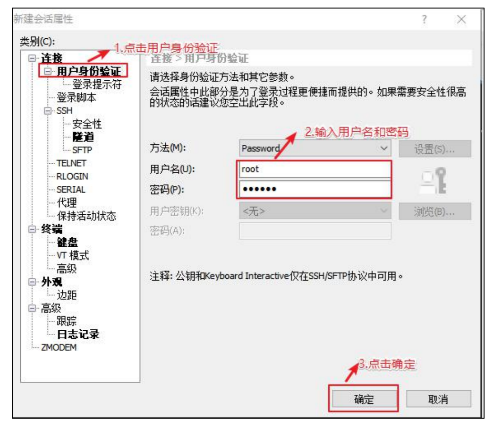

# 第 3 章 远程终端工具安装

通常在工作过程中，公司中使用的真实服务器或者是云服务器，都不允许除运维人员之外的员工直接接触，因此就需要通过远程登录的方式来操作。所以，远程登录工具就是必不可缺的，目前，比较主流的有 Xshell，SSH Secure Shell，SecureCRT，FinalShell 等，同学们可以根据自己的习惯自行选择，以下以 Xshell5 为例。

## 3.1 Xshell5 安装和配置

### 3.1.1 安装 Xshell5

1. 一直点击下一步，但是有一页收费页，点击免费版，图如下

2. 出现如下界面安装成功

### 3.1.2 配置 Xshell 终端

1. 打开安装好的 Xshell

2. 编辑新链接

3. 测试链接

4. 连接成功

