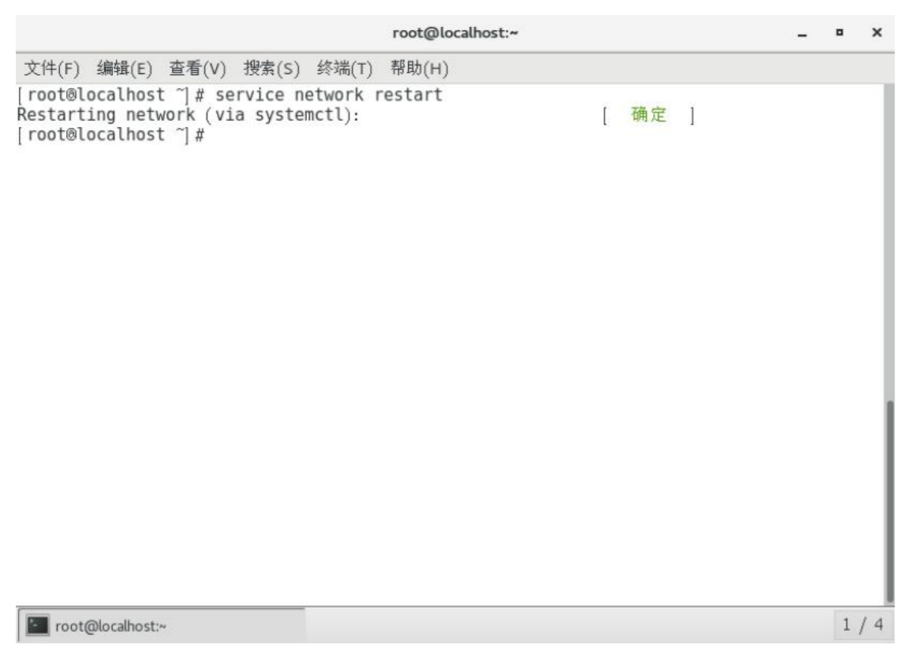

# 第五章 网络配置

## 5.1 查看网络 IP 和 网关

1. 查看虚拟网络编辑器，如图所示


2. 修改虚拟网卡 Ip，如图所示


3. 查看网关，如图所示


4. 查看 windows 环境的中 VMnet8 网络配置，如图所示


## 5.2 配置网络 ip 地址

### 5.2.1 ifconfig 配置网络接口

ifconfig :network interfaces configuring 网络接口配置

1. 基本语法

ifconfig （功能描述：显示所有网络接口的配置信息）

2. 案例实操

查看当前网络 ip：

```shell
ifconfig
```

### 5.2.2 ping 测试主机之间网络连通性

1. 基本语法

ping 目标主机 （功能描述：测试当前服务器是否可以连接目的主机）

2. 案例实操

测试当前服务器是否可以连接百度

```shell
ping www.baidu.com
```

### 5.2.3 修改 IP 地址

1. 查看 IP 配置文件

```shell
vim /etc/sysconfig/network-scripts/ifcfg-ens33
```


以下标红的项必须修改，值按照下面的值修改


```text
BOOTPROTO="static" #IP 的配置方法[none|static|bootp|dhcp]（引导时 不使用协议|静态分配 IP|BOOTP 协议|DHCP 协议）
ONBOOT="yes" #系统启动的时候网络接口是否有效（yes/no）
#IP 地址
IPADDR=192.168.1.100
#网关
GATEWAY=192.168.1.2
#域名解析器
DNS1=192.168.1.2
```

编辑完后，按键盘 esc ，然后输入 :wq 回车即可。

2. 执行 service network restart 重启网络，如图所示



### 5.2.4 修改 IP 地址后可能会遇到的问题

1. 物理机能 ping 通虚拟机，但是虚拟机 ping 不通物理机,一般都是因为物理机的防火墙问题,把防火墙关闭就行

2. 虚拟机能 Ping 通物理机,但是虚拟机 Ping 不通外网,一般都是因为 DNS 的设置有问题

3. 虚拟机 Ping www.baidu.com 显示域名未知等信息,一般查看 GATEWAY 和 DNS 设置是否正确

4. 如果以上全部设置完还是不行，需要关闭 NetworkManager 服务

* systemctl stop NetworkManager 关闭
* systemctl disable NetworkManager 禁用

5. 如果检查发现 systemctl status network 有问题 需要检查 ifcfg-ens33

## 5.3 配置主机名

### 5.3.1 修改主机名称

1. 基本语法

hostname （功能描述：查看当前服务器的主机名称）

2. 案例实操

查看当前服务器主机名称：

```shell
hostname
```

如果感觉此主机名不合适，我们可以进行修改。通过编辑/etc/hostname 文件

```shell
vi /etc/hostname
```

修改完成后重启生效。

### 5.3.2 修改 hosts 映射文件

1. 修改 linux 的主机映射文件（hosts 文件）   
  后续在 hadoop 阶段，虚拟机会比较多，配置时通常会采用主机名的方式配置，   
  比较简单方便。 不用刻意记 ip 地址。

1.1 打开/etc/hosts

```shell
vim /etc/hosts
```

1.2 添加如下内容

```text
192.168.2.100 hadoop100
192.168.2.101 hadoop101
192.168.2.102 hadoop102
192.168.2.103 hadoop103
192.168.2.104 hadoop104
192.168.2.105 hadoop105
```
1.3 重启设备，重启后，查看主机名，已经修改成功

2. 修改 windows 的主机映射文件（hosts 文件）

2.1 进入 C:\Windows\System32\drivers\etc 路径

2.2 打开 hosts 文件并添加如下内容

```text
192.168.2.100 hadoop100
192.168.2.101 hadoop101
192.168.2.102 hadoop102
192.168.2.103 hadoop103
192.168.2.104 hadoop104
192.168.2.105 hadoop105
```

3. 修改 window10 的主机映射文件（hosts 文件）

3.1 进入 C:\Windows\System32\drivers\etc 路径
3.2 拷贝 hosts 文件到桌面
3.3 打开桌面 hosts 文件并添加如下内容

```text
192.168.2.100 hadoop100
192.168.2.101 hadoop101
192.168.2.102 hadoop102
192.168.2.103 hadoop103
192.168.2.104 hadoop104
192.168.2.105 hadoop105
```

3.4 将桌面 hosts 文件覆盖 C:\Windows\System32\drivers\etc 路径 hosts 文件

## 5.4 远程登录

通常在工作过程中，公司中使用的真实服务器或者是云服务器，都不允许除运维人员之外的员工直接接触，因此就需要通过远程登录的方式来操作。所以，远程登录工具就是必不可缺的，目前，比较主流的有 Xshell, SSH Secure Shell, SecureCRT,FinalShell 等，可以根据自己的习惯自行选择。