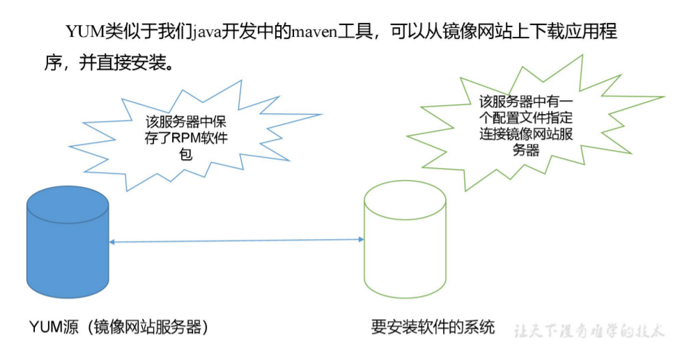
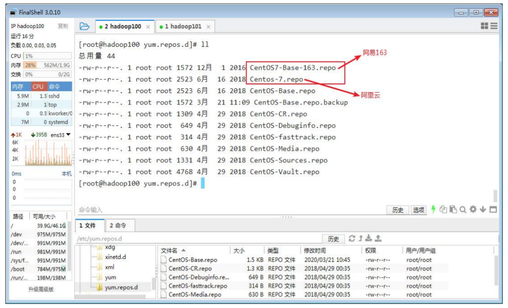

# 第八章 软件包管理

## 8.1 RPM

### 8.1.1 RPM 概述

RPM（RedHat Package Manager），RedHat 软件包管理工具，类似windows里面的 setup.exe 是 Linux 这系列操作系统里面的打包安装工具，它虽然是RedHat的标志，但理念是通用的。

RPM包的名称格式：

Apache-1.3.23-11.i386.rpm

- “apache” 软件名称
- “1.3.23-11”软件的版本号，主版本和此版本
- “i386”是软件所运行的硬件平台，Intel 32位处理器的统称
- “rpm”文件扩展名，代表RPM包

### 8.1.2 语法格式

rpm [参数] 软件包

### 8.1.3 常用参数

|  选项   |            功能            |
|:-----:|:------------------------:|
|  -a   |         查询所有的软件包         |
| -b或-t | 设置包装套件的完成阶段，并指定套件档的文件名称； |
|  -c   | 只列出组态配置文件，本参数需配合”-l”参数使用 |
|  -d   |  只列出文本文件，本参数需配合”-l”参数使用  |
|  -e   |          卸载软件包           |
|  -f   |      查询文件或命令属于哪个软件包      |
|  -h   |        安装软件包时列出标记        |
|  -i   |          安装软件包           |
|  -l   |        显示软件包的文件列表        |
|  -p   |       查询指定的rpm软件包        |
|  -q   |          查询软件包           |
|  -R   |        显示软件包的依赖关系        |
|  -s   |  显示文件状态，本参数需配合”-l”参数使用   |
|  -U   |          升级软件包           |
|  -v   |         显示命令执行过程         |
|  -vv  |        详细显示指令执行过程        |

### 8.1.4 RPM 查询命令（rpm -qa）

1. 基本语法

rpm -qa （功能描述：查询所安装的所有 rpm 软件包）

2. 经验技巧

由于软件包比较多，一般都会采取过滤。rpm -qa | grep 软件包名称

3. 参考实例

查询firefox软件安装情况

```shell
rpm -qa |grep firefox
#firefox-45.0.1-1.el6.centos.x86_64
```

### 8.1.5 RPM 卸载命令（rpm -e）

1. 基本语法

rpm -e RPM软件包

rpm -e --nodeps 软件包

2. 选项说明

|    选项    |                     功能                     |
|:--------:|:------------------------------------------:|
|    -e    |                   卸载软件包                    |
| --nodeps | 卸载软件时，不检查依赖。这样的话，那些使用该软件包的软件在此之后可能就不能正常工作了 |

3. 参考实例

卸载firefox软件

```shell
rpm -e firefox
```

### 8.1.6 RPM 安装命令（rpm -ivh）

1. 基本语法

rpm -ivh RPM 包全名

2. 选项说明

|    选项    |        功能        |
|:--------:|:----------------:|
|    -i    |    install，安装    |
|    -v    | --verbose，显示详细信息 |
|    -h    |    --hash，进度条    |
| --nodeps |     安装前不检查依赖     |

3. 参考实例

安装firefox软件

```shell
rpm -ivh firefox-45.0.1-1.el6.centos.x86_64.rpm
```

## 8.2 YUM 仓库配置

### 8.2.1 YUM 概述

YUM（全称为 Yellow dog Updater, Modified）是一个在 Fedora 和 RedHat 以及 CentOS中的 Shell 前端软件包管理器。基于 RPM 包管理，能够从指定的服务器自动下载 RPM 包并且安装，可以自动处理依赖性关系，并且一次安装所有依赖的软件包，无须繁琐地一次次下载、安装，如图所示



### 8.2.2 YUM 的常用命令

1. 基本语法

yum [参数] [选项]

2. 常用参数

| 参数  |           功能            |
|:---:|:-----------------------:|
| -h  |         显示帮助信息          |
| -y  |     对所有的提问都回答“yes”      |
| -c  |         指定配置文件          |
| -q  |          安静模式           |
| -v  |          详细模式           |
| -t  |         检查外部错误          |
| -d  |      设置调试等级（0-10）       |
| -e  |      设置错误等级（0-10）       |
| -R  |   设置yum处理一个命令的最大等待时间    |
| -C  | 完全从缓存中运行，而不去下载或者更新任何头文件 |

3. 常用选项

|      选项      |          功能           |
|:------------:|:---------------------:|
|   install    |       安装rpm软件包        |
|    update    |       更新rpm软件包        |
| check-update |   检查是否有可用的更新rpm软件包    |
|    remove    |      删除指定的rpm软件包      |
|     list     |       显示软件包的信息        |
|    search    |       检查软件包的信息        |
|     info     | 显示指定的rpm软件包的描述信息和概要信息 |
|    clean     |      清理yum过期的缓存       |
|    shell     |    进入yum的shell提示符     |
|  resolvedep  |     显示rpm软件包的依赖关系     |
| localinstall |      安装本地的rpm软件包      |
| localupdate  |    显示本地rpm软件包进行更新     |
|   deplist    |    显示rpm软件包的所有依赖关系    |

4. 参考实例

采用 yum 方式安装 firefox

```shell
yum -y install firefox
```

自动搜索最快镜像插件

```shell
yum install yum-fastestmirror
```

安装yum图形窗口插件

```shell
yum install yumex
```

清除缓存目录下的软件包

```shell
yum clean packages
```

列出匹配到“foo*”的可用的数据包

```shell
yum list available 'foo*' 
```

查看可能批量安装的列表

```shell
yum grouplist  
```

### 8.2.3 修改网络 YUM 源

默认的系统 YUM 源，需要连接国外 apache 网站，网速比较慢，可以修改关联的网络 YUM 源为国内镜像的网站，比如网易 163,aliyun 等

1. 安装 wget, wget 用来从指定的 URL 下载文件

```shell
yum install wget
```

2. 在/etc/yum.repos.d/目录下，备份默认的 repos 文件

```shell
pwd
#/etc/yum.repos.d
cp CentOS-Base.repo CentOS-Base.repo.backup
```

3. 下载网易 163 或者是 aliyun 的 repos 文件,任选其一，如图

```shell
wget http://mirrors.aliyun.com/repo/Centos-7.repo //阿里云
wget http://mirrors.163.com/.help/CentOS7-Base-163.repo //网易 163
```



4. 使用下载好的 repos 文件替换默认的 repos 文件，例如:用 CentOS7-Base-163.repo 替换 CentOS-Base.repo

```shell
mv CentOS7-Base-163.repo CentOS-Base.repo
```

5. 清理旧缓存数据，缓存新数据

```shell
yum clean all
yum makecache
```

yum makecache 就是把服务器的包信息下载到本地电脑缓存起来

6. 测试

```shell
yum list | grep firefox
yum -y install firefox
```