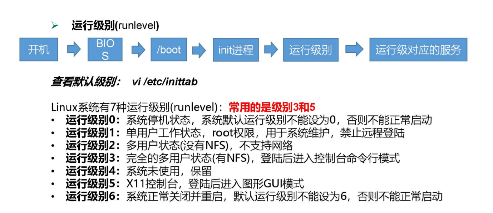

# 第6章 系统管理

## 6.1 Linux 中的进程和服务

计算机中，一个正在执行的程序或命令，被叫做“进程”（process）。

启动之后一只存在、常驻内存的进程，一般被称作“服务”（service）。

## 6.2 service 服务管理（CentOS 6 版本）

1. 基本语法

service 服务名 start | stop | restart | status

2. 经验技巧

查看服务的方法：/etc/init.d/服务名 ,发现只有两个服务保留在 service

```shell
pwd
#/etc/init.d

ls -al
#drwxr-xr-x. 2 root root 4096 3 月 19 15:24 .
#drwxr-xr-x. 10 root root 4096 3 月 19 15:24 ..
#-rw-r--r--. 1 root root 18104 1 月 3 2018 functions
#-rwxr-xr-x. 1 root root 4334 1 月 3 2018 netconsole
#-rwxr-xr-x. 1 root root 7293 1 月 3 2018 network
#-rw-r--r--. 1 root root 1160 4 月 11 2018 README
```

3. 参考实例

```shell
#1. 查看网络服务的状态
service network status 

#2. 停止网络服务
service network stop

#3.启动网络服务
service network start

#4. 重启网络服务
service network restart
```

## 6.3 chkconfig 设置后台服务的自启配置（CentOS 6 版本）

1. 基本语法

chkconfig （功能描述：查看所有服务器自启配置）

chkconfig 服务名 off （功能描述：关掉指定服务的自动启动）

chkconfig 服务名 on （功能描述：开启指定服务的自动启动）

chkconfig 服务名 --list （功能描述：查看服务开机启动状态）

2. 参考实例

开启/关闭 network(网络)服务的自动启动

```shell
chkconfig network on

chkconfig network off
```

开启/关闭 network 服务指定级别的自动启动

```shell
chkconfig --level 指定级别 network on

chkconfig --level 指定级别 network off
```

## 6.4 systemctl （CentOS 7 版本）

1. 基本语法

systemctl start|stop|restart|status 服务名

2. 经验技巧

查看服务的方法：/usr/lib/systemd/system

```shell
pwd
#/usr/lib/systemd/system

ls -al
#-rw-r--r--. 1 root root 275 4 月 27 2018 abrt-ccpp.service
#-rw-r--r--. 1 root root 380 4 月 27 2018 abrtd.service
#-rw-r--r--. 1 root root 361 4 月 27 2018 abrt-oops.service
#-rw-r--r--. 1 root root 266 4 月 27 2018 abrt-pstoreoops.service
#-rw-r--r--. 1 root root 262 4 月 27 2018 abrt-vmcore.service
#-rw-r--r--. 1 root root 311 4 月 27 2018 abrt-xorg.service
#-rw-r--r--. 1 root root 751 4 月 11 2018 accounts-daemon.service
#-rw-r--r--. 1 root root 527 3 月 25 2017 alsa-restore.service
#-rw-r--r--. 1 root root 486 3 月 25 2017 alsa-state.service
```

3. 参考实例

查看防火墙服务的状态

```shell
systemctl status firewalld
```

停止防火墙服务

```shell
systemctl stop firewalld
```

启动防火墙服务

```shell
systemctl start firewalld
```

重启防火墙服务

```shell
systemctl restart firewalld
```

## 6.5 systemctl 设置后台服务的自启配置

1. 基本语法

systemctl list-unit-files （功能描述：查看服务开机启动状态）

systemctl disable service_name （功能描述：关掉指定服务的自动启动）

systemctl enable service_name （功能描述：开启指定服务的自动启动）

2. 参考实例

开启/关闭 iptables(防火墙)服务的自动启动

```shell
systemctl enable firewalld.service

systemctl disable firewalld.service 
```

## 6.6 系统运行级别

1. Linux 运行级别(CentOS 6)，如图所示



2. CentOS7 的运行级别简化为:

multi-user.target 等价于原运行级别 3（多用户有网，无图形界面）

graphical.target 等价于原运行级别 5（多用户有网，有图形界面）

3. 查看当前运行级别:

systemctl get-default

4. 修改当前运行级别

systemctl set-default TARGET.target （这里 TARGET 取 multi-user 或者 graphical）

## 6.7 关闭防火墙

1. 临时关闭防火墙

查看防火墙状态

```shell
systemctl status firewalld
```

临时关闭防火墙

```shell
systemctl stop firewalld
```

2. 开机启动时关闭防火墙

查看防火墙开机启动状态

```shell
systemctl enable firewalld.service 
```

设置开机时关闭防火墙

```shell
systemctl disable firewalld.service 
```

## 6.8 关机重启命令

在 linux 领域内大多用在服务器上，很少遇到关机的操作。毕竟服务器上跑一个服务是永无止境的，除非特殊情况下，不得已才会关机。

1. 基本语法

sync （功能描述：将数据由内存同步到硬盘中）

halt （功能描述：停机，关闭系统，但不断电）

poweroff （功能描述：关机，断电）

reboot （功能描述：就是重启，等同于 shutdown -r now）

shutdown [选项] 时间

| 选项  |        功能        |
|:---:|:----------------:|
| -H  |   相当于--halt，停机   |
| -r  |   -r=reboot 重启   |
| now |       立刻关机       |
| 时间  | 等待多久后关机（时间单位是分钟） |

2. 经验技巧

Linux 系统中为了提高磁盘的读写效率，对磁盘采取了 “预读迟写”操作方式。当用户保存文件时，Linux 核心并不一定立即将保存数据写入物理磁盘中，而是将数据保存在缓冲区中，等缓冲区满时再写入磁盘，这种方式可以极大的提高磁盘写入数据的效率。但是，也带来了安全隐患，如果数据还未写入磁盘时，系统掉电或者其他严重问题出现，则将导致数据丢失。使用 sync 指令可以立即将缓冲区的数据写入磁盘。

3. 参考实例

将数据由内存同步到硬盘中

```shell
sync
```

重启

```shell
reboot
```

停机（不断电）

```shell
halt
```

计算机将在 1 分钟后关机，并且会显示在登录用户的当前屏幕中

```shell
shutdown -h 1 'This server will shutdown after 1 mins'
```

立马关机（等同于 poweroff）

```shell
shutdown -h now 
```

系统立马重启（等同于 reboot）

```shell
shutdown -r now
```