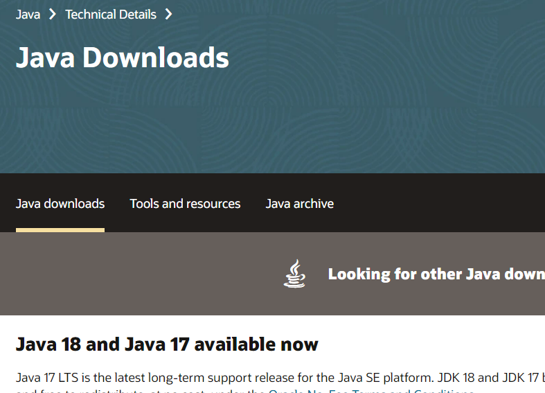
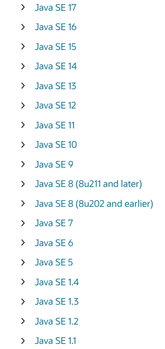
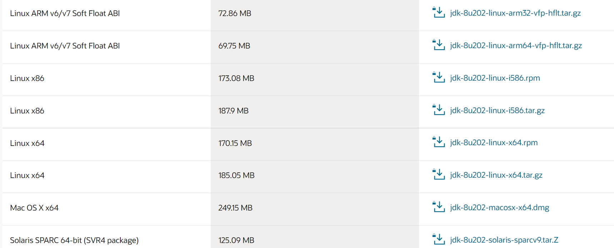

# 11.1 JDK

1. 进入JDK下载页面

https://www.oracle.com/java/technologies/downloads/

2. 点击Java archive



3. 点入所需要的版本



4. 选择以`.tar.gz`结尾的的版本

* ARM表示适用于ARM架构的cpu
* x86表示适用于32位的x86-64架构cpu
* x64表示适用于64位的x86-64架构cpu



5. 创建文件夹用于存放jdk压缩包

```shell
mkdir /opt/jdk
```

6. 将下载的文件上传到上一步建好的文件夹中

7. 解压上传的文件

```shell
cd /opt/jdk
tar -zxvf jdk-8u202-linux-x64.tar.gz 
```

8. 创建jdk工作目录

```shell
mkdir /usr/local/java
```

9. 将解压出的文件转移到刚创建的文件夹中

```shell
mv jdk1.8.0_202/ /usr/local/java
```

10. 编辑环境变量的配置文件 

```shell
vim /etc/profile
```

在该文件的末尾增加两行

```text
export JAVA_HOME=/usr/local/java/jdk1.8.0_202
export PATH=$JAVA_HOME/bin:$PATH
```

11. source /etc/profile 让新的环境变量生效

12. 测试

```shell
java -version
#java version "1.8.0_202"
#Java(TM) SE Runtime Environment (build 1.8.0_202-b08)
#Java HotSpot(TM) 64-Bit Server VM (build 25.202-b08, mixed mode)
```