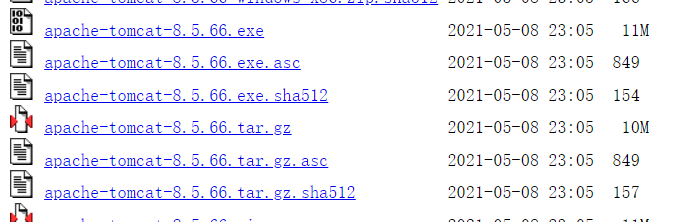
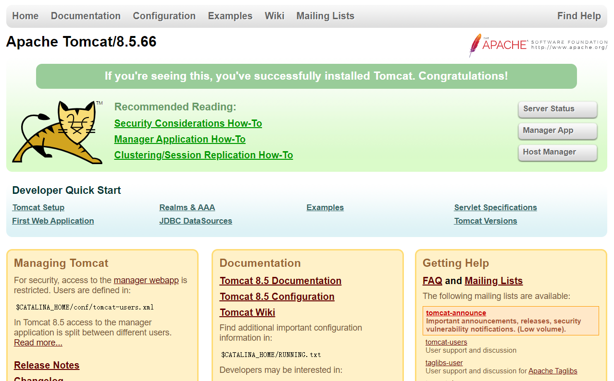

# 11.2 Tomcat

1. 进入Tomcat官网

https://tomcat.apache.org/

2. 下载需要的版本

https://archive.apache.org/dist/tomcat/tomcat-8/v8.5.66/bin/



3. 创建文件夹

```shell
mkdir /opt/tomcat
```

4. 将下载的压缩包上传到tomcat目录中

5. 解压压缩包

```shell
tar -zxvf apache-tomcat-8.5.66.tar.gz 
```

6. 进入bin目录并启动tomcat

```shell
cd apache-tomcat-8.5.66/bin
./startup.sh 
```

7. 开放防火墙的8080端口

```shell
firewall-cmd --permanent --add-port=8080/tcp
firewall-cmd --reload
```

8. 测试访问

