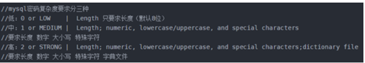
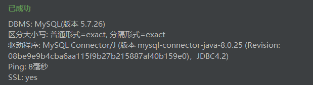

# 11.3 MySQL

1. 新建文件夹/opt/mysql，并进入

```shell
mkdir /opt/mysql
cd /opt/mysql
```

2. 运行wget http://dev.mysql.com/get/mysql-5.7.26-1.el7.x86_64.rpm-bundle.tar，下载mysql安装包

```shell
wget http://dev.mysql.com/get/mysql-5.7.26-1.el7.x86_64.rpm-bundle.tar
```

3. 解压压缩包

```shell
tar -xvf mysql-5.7.26-1.el7.x86_64.rpm-bundle.tar 
```

4. 由于centos7自带的类mysql数据库是mariadb，会跟mysql冲突，要先删除。查看是否存在mariadb

```shell
rpm -qa | grep mariadb
```

5. 如果有，则删除

```shell
rpm -e --nodeps mariadb-libs
```

6. 运行以下命令安装MySQL

```shell
rpm -ivh mysql-community-common-5.7.26-1.el7.x86_64.rpm
rpm -ivh mysql-community-libs-5.7.26-1.el7.x86_64.rpm
rpm -ivh mysql-community-client-5.7.26-1.el7.x86_64.rpm
rpm -ivh mysql-community-server-5.7.26-1.el7.x86_64.rpm
```

7. 运行systemctl start mysqld.service，启动mysql

```shell
systemctl start mysqld.service
```

8. Mysql自动给root用户设置随机密码，运行grep "password" /var/log/mysqld.log可看到当前密码

```shell
grep "password" /var/log/mysqld.log
```

10. 使用得到的密码登录MySQL

```shell
mysql -u root -p
```

11. 对于个人开发环境，如果要设比较简单的密码（生产环境服务器要设复杂密码），可以运行`set global validate_password_policy=0;`设置较低的提示密码设置策略（validate_password_policy默认值1）



```sql
set global validate_password_policy=0;
set global validate_password_mixed_case_count=0;
set global validate_password_number_count=0;
set global validate_password_special_char_count=0;
set global validate_password_length=3;
```

12. 设置root密码

```sql
set password for 'root'@'localhost' =password('123456');
```

13. 运行flush privileges;使密码设置生效

```sql
flush privileges;
```

14. 开放MySQL远程访问权限

```sql
Grant all privileges on *.* to 'root'@'%' identified by '123456' with grant option;
```

15. 开放3306端口

```shell
firewall-cmd --zone=public --add-port=3306/tcp --permanent   # 开放5672端口
firewall-cmd --reload
```

16. 测试连接结果

