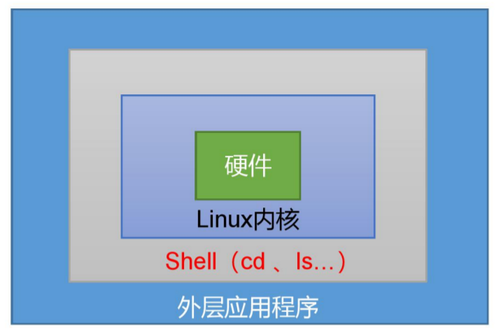

# 10.1 Shell概述

Shell 是一个命令行解释器，它接收应用程序/用户命令，然后调用操作系统内核



Shell 还是一个功能相当强大的编程语言，易编写、易调试、灵活性强

1. Linux 提供的 Shell 解析器有

```shell
cat /etc/shells
#/bin/sh
#/bin/bash
#/usr/bin/sh
#/usr/bin/bash
#/bin/tcsh
#/bin/csh
```

2. bash 和 sh 的关系

```shell
ll | grep bash
#-rwxr-xr-x. 1 root root 941880 5 月 11 2016 bash
#lrwxrwxrwx. 1 root root 4 5 月 27 2017 sh -> bash
```

3. Centos 默认的解析器是 bash

```shell
echo $SHELL
#/bin/bash
```