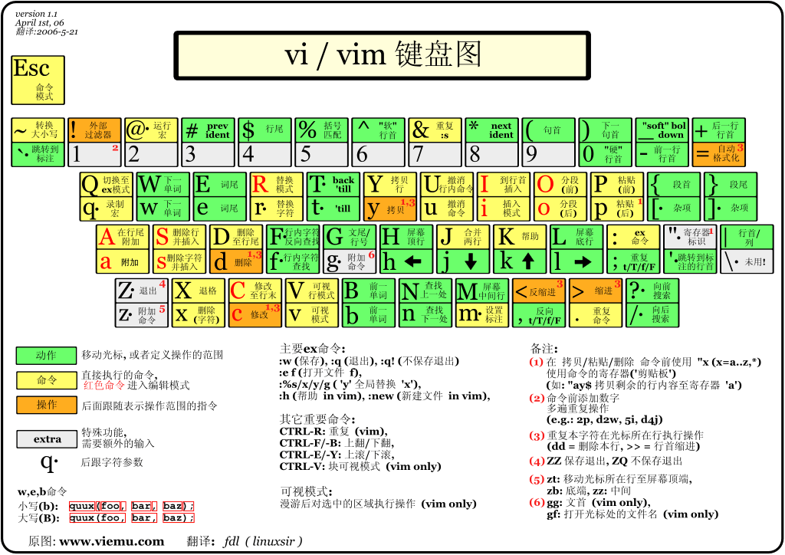
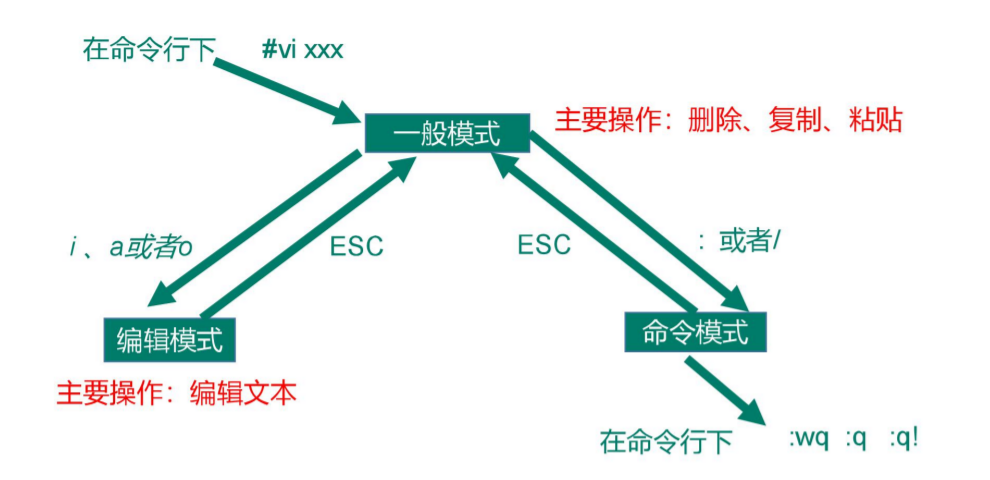

# 第四章 VI/VIM编辑器

## 4.1 是什么

VI 是 Unix 操作系统和类 Unix 操作系统中最通用的文本编辑器。

VIM 编辑器是从 VI 发展出来的一个性能更强大的文本编辑器。可以主动的以字体颜色辨别语法的正确性，方便程序设计。VIM 与 VI 编辑器完全兼容。

## 4.2 测试数据准备

1. 拷贝/etc/profile 数据到/root 目录下

```shell
cp /etc/profile /root
cd /root/
```

## 4.3 一般模式

以 vi 打开一个档案就直接进入一般模式了（这是默认的模式）。在这个模式中，你可以使用『上下左右』按键来移动光标，你可以使用『删除字符』或『删除整行』来处理档案内容，也可以使用『复制、粘贴』来处理你的文件数据。

常用快捷键：

|      语法       |         功能描述         |
|:-------------:|:--------------------:|
|      yy       |       复制光标当前一行       |
|    y 数字 y     |      复制光标及以下多少行      |
|       p       |      箭头移动到目的行粘贴      |
|       u       |        撤销上一步         |
|      dd       |       删除光标当前行        |
|    d 数字 d     |     删除光标（含）后多少行      |
|       x       |    剪切一个字母，相当于 de     |
|       X       | 剪切一个字母，相当于 Backspace |
|      yw       |        复制一个词         |
|      dw       |        删除一个词         |
|  shift+6(^)   |        移动到行头         |
|  shift+4($)   |        移动到行尾         |
| 1+shift+g(1G) |       移动到页头，数字       |
|  shift+g(G)   |        移动到页尾         |
|  数字+shift+g   |        移动到目标行        |



## 4.4 编辑模式

在一般模式中可以进行删除、复制、粘贴等的动作，但是却无法编辑文件内容的！要等到你按下『i, I, o, O, a, A』等任何一个字母之后才会进入编辑模式。注意了！通常在Linux中，按下这些按键时，在画面的左下方会出现『INSERT或REPLACE』的字样，此时才可以进行编辑。而如果要回到一般模式时， 则必须要按下『Esc』这个按键即可退出编辑模式。

1. 进入编辑模式

语法：

| 按键  |    功能     |
|:---:|:---------:|
|  i  |   当前光标前   |
|  a  |   当前光标后   |
|  o  | 当前光标行的下一行 |
|  I  |  光标所在行最前  |
|  A  |  光标所在行最后  |
|  O  | 当前光标行的上一行 |

2. 退出编辑模式

按『Esc』键 退出编辑模式，之后所在的模式为一般模式。

## 4.5 指令模式

在一般模式当中，输入『 : / ?』3个中的任何一个按钮，就可以将光标移动到最底下那一行。

在这个模式当中， 可以提供你『搜寻资料』的动作，而读取、存盘、大量取代字符、离开 vi 、显示行号等动作是在此模式中达成的！

1. 基本语法

|      命令       |         功能         |
|:-------------:|:------------------:|
|      :w       |         保存         |
|      :q       |         退出         |
|      :!       |        强制执行        |
|      :!q      |        强制退出        |
|    /要查找的词     |   n 查找下一个，N 往上查找   |
|     :noh      |       取消高亮显示       |
|     :noh      |        显示行号        |
|   :set nonu   |        关闭行号        |
| :%s/old/new/g | 替换内容 /g 替换匹配到的所有内容 |

2. 案例实操

强制保存退出

`:wq!`

## 4.6 模式间转换

