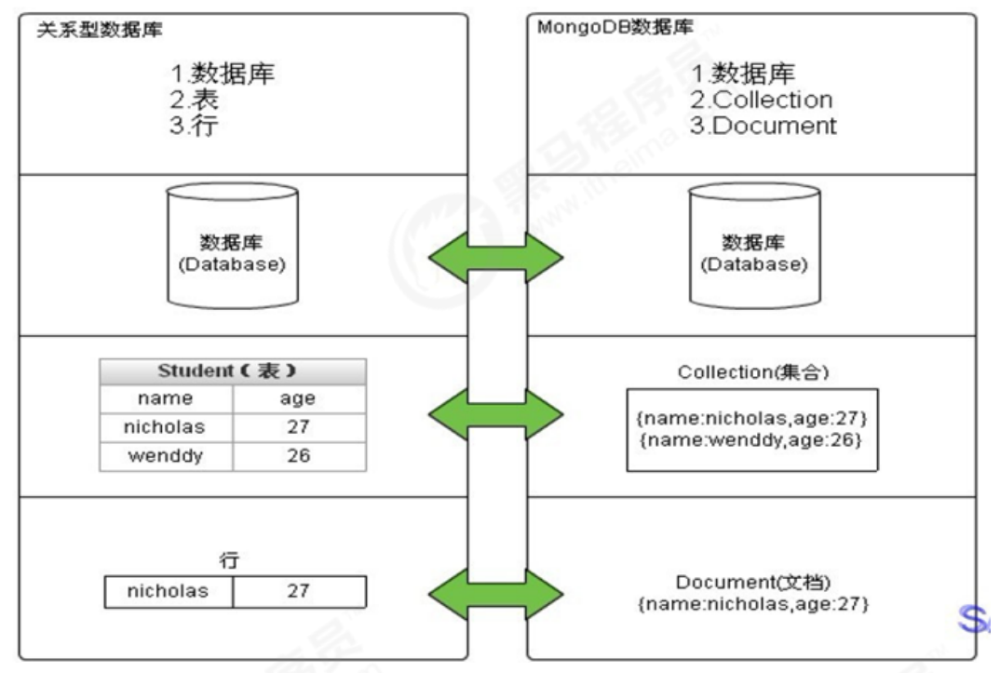

# 第一章 MongoDB相关概念

## 1.1 业务应用场景

传统的关系型数据库（如MySQL），在数据操作的“三高”需求以及应对Web2.0的网站需求面前，显得力不从心。

“"三高”需求： 
* High performance - 对数据库高并发读写的需求。
* Huge Storage - 对海量数据的高效率存储和访问的需求。
* High Scalability && High Availability- 对数据库的高可扩展性和高可用性的需求。

### 1.1.1 MongoDB可轻松应对“三高”需求

具体的应用场景如：
1) 社交场景，使用 MongoDB 存储存储用户信息，以及用户发表的朋友圈信息，通过地理位置索引实现附近的人、地点等功能。
2) 游戏场景，使用 MongoDB 存储游戏用户信息，用户的装备、积分等直接以内嵌文档的形式存储，方便查询、高效率存储和访问。
3) 物流场景，使用 MongoDB 存储订单信息，订单状态在运送过程中会不断更新，以 MongoDB 内嵌数组的形式来存储，一次查询就能将订单所有的变更读取出来。
4) 物联网场景，使用 MongoDB 存储所有接入的智能设备信息，以及设备汇报的日志信息，并对这些信息进行多维度的分析。
5) 视频直播，使用 MongoDB 存储用户信息、点赞互动信息等。

这些应用场景中，数据操作方面的共同特点是：
1. 数据量大
2. 写入操作频繁（读写都很频繁）
3. 价值较低的数据，对事务性要求不高

对于这样的数据，我们更适合使用MongoDB来实现数据的存储。

### 1.1.2 什么时候选择MongoDB

在架构选型上，除了上述的三个特点外，还可以考虑以下的一些问题：
1. 应用不需要事务及复杂 join 支持
2. 新应用，需求会变，数据模型无法确定，想快速迭代开发
3. 应用需要2000-3000以上的读写QPS（更高也可以）
4. 应用需要TB甚至 PB 级别数据存储
5. 应用发展迅速，需要能快速水平扩展
6. 应用要求存储的数据不丢失
7. 应用需要99.999%高可用
8. 应用需要大量的地理位置查询、文本查询
如果上述有1个符合，可以考虑 MongoDB，2个及以上的符合，可以选择 MongoDB 

思考：对比用MySQL，使用MongoDB更有哪些优势？

答：相对MySQL，可以以更低的成本解决问题（包括学习、开发、运维等成本）

## 1.2 MongoDB简介

MongoDB是一个开源、高性能、无模式的文档型数据库，当初的设计就是用于简化开发和方便扩展，是NoSQL数据库产品中的一种。是最像关系型数据库（MySQL）的非关系型数据库。

它支持的数据结构非常松散，是一种类似于 JSON 的 格式叫BSON，所以它既可以存储比较复杂的数据类型，又相当的灵活。

MongoDB中的记录是一个文档，它是一个由字段和值对（field:value）组成的数据结构。MongoDB文档类似于JSON对象，即一个文档认为就是一个对象。字段的数据类型是字符型，它的值除了使用基本的一些类型外，还可以包括其他文档、普通数组和文档数组。

## 1.3 体系结构

MySQL和MongoDB对比

|  SQL术语/概念   | MongoDB术语/概念 |          解释/说明          |
|:-----------:|:------------:|:-----------------------:|
|  database   |   database   |           数据库           |
|    table    |  collection  |         数据库表/集合         |
|     row     |   document   |        数据记录行/文档         |
|   column    |    field     |         数据字段/域          |
|    index    |    index     |           索引            |
| table joins |              |     表连接,MongoDB不支持      |
|             |     嵌入文档     |  MongoDB通过嵌入式文档来替代多表连接  |
| primary key | primary key  | 主键,MongoDB自动将_id字段设置为主键 |

