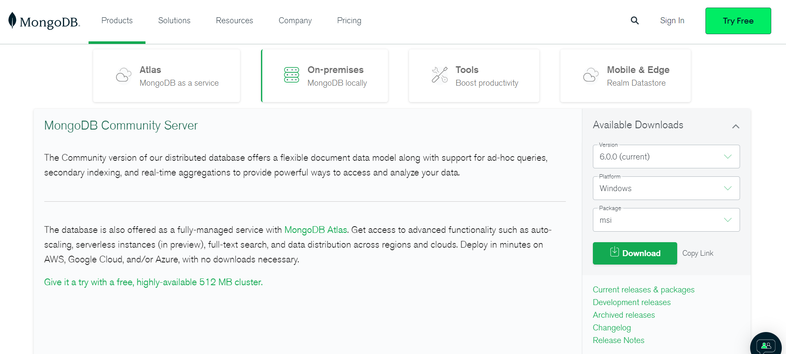
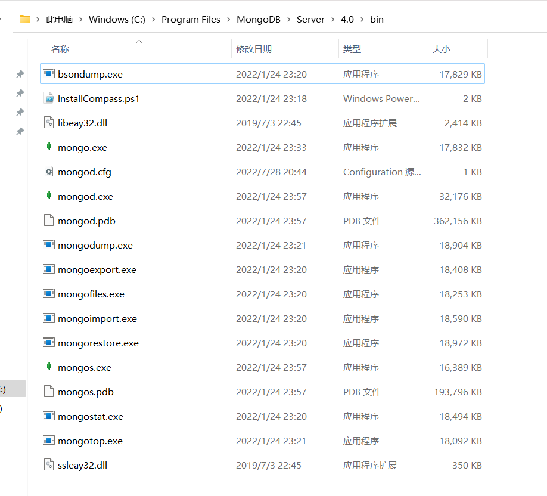
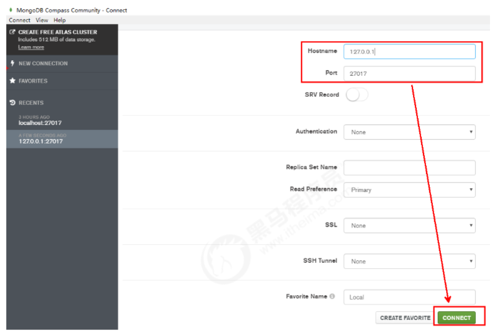
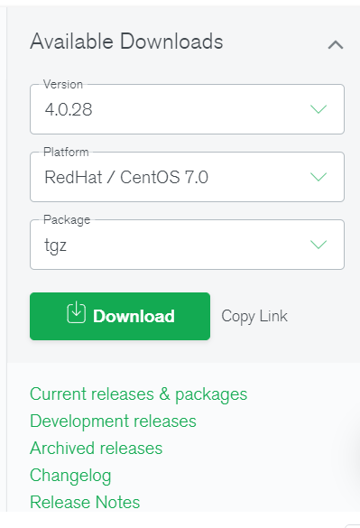

# 第二章 单机部署

## 2.1 Windows系统中的安装启动

### 2.1.1 第一步：下载安装包

MongoDB 提供了可用于 32 位和 64 位系统的预编译二进制包，你可以从MongoDB官网下载安装，MongoDB 预编译二进制包下载地址：https://www.mongodb.com/try/download/community



提示：版本的选择：\
MongoDB的版本命名规范如：x.y.z；\
y为奇数时表示当前版本为开发版，如：1.5.2、4.1.13；\
y为偶数时表示当前版本为稳定版，如：1.6.3、4.0.10；\
z是修正版本号，数字越大越好。

详情：http://docs.mongodb.org/manual/release-notes/#release-version-numbers

### 2.1.2 第二步：解压安装启动

如果下载的是`.msi`文件直接打开安装即可

如果下载的是`.zip`文件：

将压缩包解压到一个目录中。\
在解压目录中，手动建立一个目录用于存放数据文件，如 `data/db`

方式1：命令行参数方式启动服务

在 bin 目录中打开命令行提示符，输入如下命令：

```shell
mongod --dbpath=..\data\db
```

我们在启动信息中可以看到，mongoDB的默认端口是27017，如果我们想改变默认的启动端口，可以通过--port来指定端口。

为了方便我们每次启动，可以将安装目录的bin目录设置到环境变量的path中， bin 目录下是一些常用命令，比如 mongod 启动服务用的，mongo 客户端连接服务用的。

方式2：配置文件方式启动服务

在解压目录中新建 config 文件夹，该文件夹中新建配置文件 mongod.conf ，内如参考如下：

```yaml
storage:
  #The directory where the mongod instance stores its data.Default Value is "\data\db" on Windows.
  dbPath: D:\02_Server\DBServer\mongodb-win32-x86_64-2008plus-ssl-4.0.1\data
```

详细配置项内容可以参考官方文档：https://docs.mongodb.com/manual/reference/configuration-options/

【注意】

1) 配置文件中不能以Tab分割字段

解决：\
将其转换成空格。

启动方式：

```shell
mongod -f ../config/mongod.conf
#或
mongod --config ../config/mongod.conf
```

更多参数配置：

```yaml
systemLog:
  destination: file
  #The path of the log file to which mongod or mongos should send all diagnostic logging information
  path: "D:/02_Server/DBServer/mongodb-win32-x86_64-2008plus-ssl-4.0.1/log/mongod.log"
  logAppend: true
storage:
  journal:
    enabled: true
  #The directory where the mongod instance stores its data.Default Value is "/data/db".
  dbPath: "D:/02_Server/DBServer/mongodb-win32-x86_64-2008plus-ssl-4.0.1/data"
net:
  #bindIp: 127.0.0.1
  port: 27017
setParameter:
  enableLocalhostAuthBypass: false
```

## 2.2 Shell连接(mongo命令)

进入服务器安装目录的bin目录中



在地址栏中输入`cmd`，打开命令提示图，然后输入以下shell命令即可完成登陆

```shell
mongo
#或
mongo --host=127.0.0.1 --port=27017
```

查看已经有的数据库

```shell
show databases
```

退出mongodb

```shell
exit
```

更多参数可以通过帮助查看：

```shell
mongo --help
```

提示：\
MongoDB javascript shell是一个基于javascript的解释器，故是支持js程序的。

## 2.3 Compass-图形化界面客户端

进入MongoDB官网下载MongoDB Compass，地址：https://www.mongodb.com/try/download/compass

如果是下载安装版，则按照步骤安装；如果是下载加压缩版，直接解压，执行里面的`MongoDBCompassCommunity.exe`文件即可。

在打开的界面中，输入主机地址、端口等相关信息，点击连接：



## 2.4 Linux系统中的安装启动和连接

目标：在Linux中部署一个单机的MongoDB，作为生产环境下使用。

提示：和Windows下操作差不多。

步骤如下：
1. 先进入官网 https://www.mongodb.com/try/download/community ，按下图显示，下载压缩包`mongod-linux-x86_64-4.0.28.tgz`。 

2. 上传压缩包到Linux中的`/opt/mongodb`目录下，解压到当前目录：

```shell
tar -xvf mongodb-linux-x86_64-4.0.10.tgz
```

3. 移动解压后的文件夹到指定的目录中：

```shell
mv mongodb-linux-x86_64-4.0.10 /usr/local/mongodb
```

4. 新建几个目录，分别用来存储数据和日志：

```shell
#数据存储目录
mkdir -p /mongodb/single/data/db
#日志存储目录
mkdir -p /mongodb/single/log
```

5. 新建并修改配置文件

```shell
vi /mongodb/single/mongod.conf
```

需要按实际主机ip修改`net.bindIp`属性

```yaml
systemLog:
  #MongoDB发送所有日志输出的目标指定为文件
  # #The path of the log file to which mongod or mongos should send all diagnostic logging information
  destination: file
  #mongod或mongos应向其发送所有诊断日志记录信息的日志文件的路径
  path: "/mongodb/single/log/mongod.log"
  #当mongos或mongod实例重新启动时，mongos或mongod会将新条目附加到现有日志文件的末尾。
  logAppend: true
storage:
  #mongod实例存储其数据的目录。storage.dbPath设置仅适用于mongod。
  ##The directory where the mongod instance stores its data.Default Value is "/data/db".
  dbPath: "/mongodb/single/data/db"
  journal:
    #启用或禁用持久性日志以确保数据文件保持有效和可恢复。
    enabled: true
processManagement:
  #启用在后台运行mongos或mongod进程的守护进程模式。
  fork: true
net:
  #服务实例绑定的IP，默认是localhost
  bindIp: localhost,192.168.163.128
  #bindIp
  #绑定的端口，默认是27017
  port: 27017
```

6. 启动MongoDB服务

```shell
/usr/local/mongodb/bin/mongod -f /mongodb/single/mongod.conf
#about to fork child process, waiting until server is ready for connections.
#forked process: 90384
#child process started successfully, parent exiting
```

注意：如果启动后不是`successfully`，则是启动失败了。原因基本上就是配置文件有问题。

7. 通过进程来查看服务是否启动了：

```shell
ps -ef |grep mongod
#root 90384 1 0 8月26 ? 00:02:13 /usr/local/mongdb/bin/mongod -f /mongodb/single/mongod.conf
```

8. 分别使用mongo命令和compass工具来连接测试。

提示：如果远程连接不上，需要配置防火墙放行，或直接关闭linux防火墙

```shell
#查看防火墙状态
systemctl status firewalld
#临时关闭防火墙
systemctl stop firewalld
#开机禁止启动防火墙
systemctl disable firewalld
```

9. 停止关闭服务 \
停止服务的方式有两种：快速关闭和标准关闭，下面依次说明：
   1. 快速关闭方法（快速，简单，数据可能会出错）

   目标：通过系统的kill命令直接杀死进程；\
   杀完要检查一下，避免有的没有杀掉。
    ```shell
    #通过进程编号关闭节点
    kill -2 54410
    ```

   补充\
   如果一旦是因为数据损坏，则需要进行如下操作（了解）：
   1. 删除lock文件：

   ```shell
   rm -f /mongodb/single/data/db/*.lock
   ```

   2. 修复数据：

   ```shell
   /usr/local/mongdb/bin/mongod --repair --dbpath=/mongodb/single/data/db
   ```

2. 标准的关闭方法（数据不容易出错，但麻烦）：

通过mongo客户端中的shutdownServer命令来关闭服务\
主要的操作步骤参考如下：

```shell
#客户端登录服务，注意，这里通过localhost登录，如果需要远程登录，必须先登录认证才行。
mongo --port 27017
#切换到admin库
use admin
#关闭服务
db.shutdownServer()
```